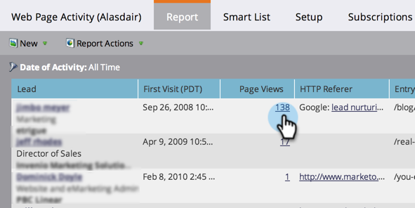

# Web Pages Viewed, Web Page Activity Report {#web-pages-viewed-web-page-activity-report}

From a [[!UICONTROL Web Page Activity] report](/help/marketo/product-docs/reporting/basic-reporting/report-types/web-page-activity-report.md), you can see the specific pages that were viewed by the people in the report.

>[!PREREQUISITES]
>
>To capture activity from your web site in Marketo, you first need to  [set up [!DNL Munchkin] on your site](/help/marketo/product-docs/administration/additional-integrations/add-munchkin-tracking-code-to-your-website.md).

1. In your [[!UICONTROL Web Page Activity] report](/help/marketo/product-docs/reporting/basic-reporting/report-types/web-page-activity-report.md), click the number in the [!UICONTROL Page Views] column.

   

1. You're there! A new window opens, showing the list of pages on your site that the person visited, and when.

   

   >[!MORELIKETHIS]
   >
   >Create a  [Company Web Activity report](/help/marketo/product-docs/reporting/basic-reporting/report-types/company-web-activity-report.md) to see which companies are visiting your site.
