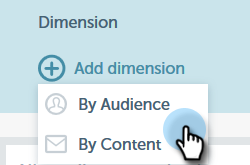

# Custom Dimensions for Email Insights {#custom-dimensions-for-email-insights}

All of the standard Marketo dimensions are included, but you have the option of adding up to 10 custom dimensions. Custom dimensions consist of segmentations and program tags. Here's how to add them.

>[!NOTE]
>
>**Admin Permissions Required**

>[!CAUTION]
>
>Custom dimensions **cannot** be deleted or replaced, so choose your 10 carefully.

1. [!UICONTROL In Email Insights], click the gear icon in the upper-right of the page.

   

1. Click **[!UICONTROL System]**.

   

1. Click the **+** next to **[!UICONTROL Add dimension]**.

   

1. Begin selecting!

   

   >[!NOTE]
   >
   >**[!UICONTROL By Audience]**: Displays all approved Segmentations (from within the Database)
   >
   >**[!UICONTROL By Content]**: Displays all Program Tags
