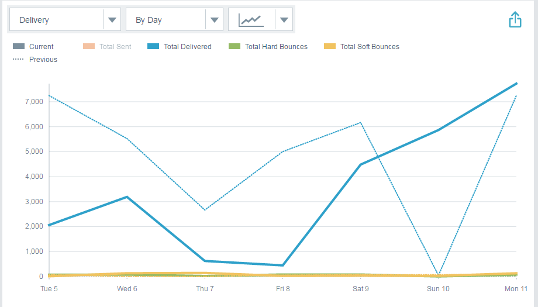

# Email Insights Analytics Overview {#email-insights-analytics-overview}

In Analytics, explore aggregate data for email delivery and engagement. Use the chart on the left to explore data, the insights on the right for a more guided experience.

[Filtering](filtering-in-email-insights.md) is available to help you drill down for specific metrics.

Key Points of Interest (KPI) tiles give you a quick look at the more popular metrics.

Hover over the KPI tiles for details...

`   
`

...or see details without having to hover by expanding your browser window (on larger screens).

` 

`

>[!TIP]
>
>Those colors mean something! Green indicates a good change, red means a bad change, gray means nothing has changed. This is based on the comparison period you've chosen in filtering.

The chart displays your filtered criteria. To hide one of your filters, simply click its color bar...

`   
`

...and the metric disappears from the chart. Click the color bar again to make it reappear.

`   
`

If you create a chart you'd like to use again, make it a [quick chart](email-insights-quick-charts.md).

`   
`

On the right side of the page, guided metrics help you discover relevant drivers. Click any metric to see it in the chart on the left side of the page.

>[!NOTE]
>
>See that Refresh on the upper right? When you see it, you'll need to manually click it to refresh the Insights module. We only show it when you have made a change to filters that would invalidate the current values.

`  
You can also specify what you see (left to right): All, Audience, Content, and Platform.  
`  `   
`

>[!NOTE]
>
>**Related Articles**
>
>[Email Insights Sends Overview](email-insights-sends-overview.md)

