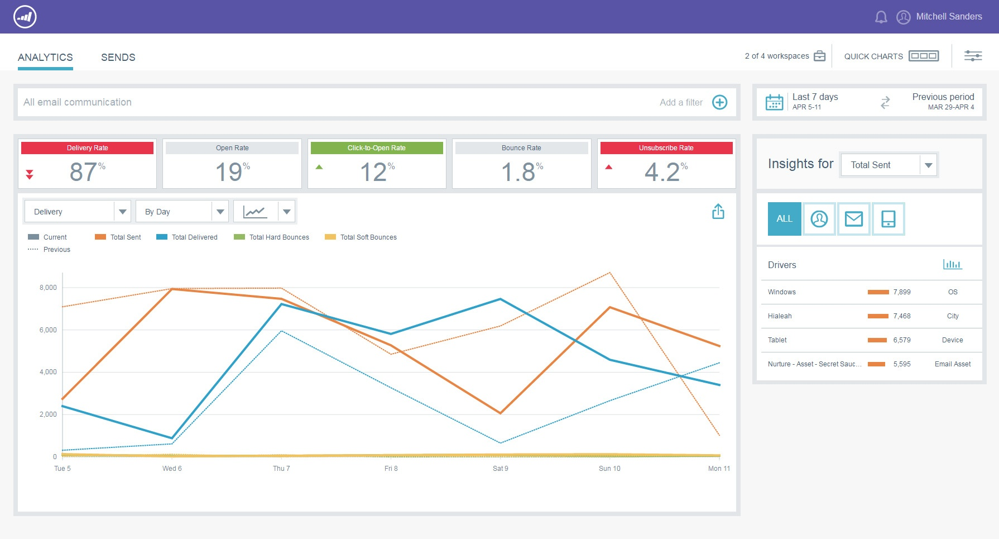
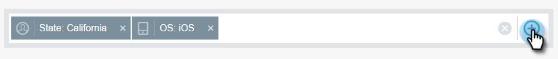

# Email Insights Overview {#email-insights-overview}

Email Insights provides powerful insights from historical data for Email Marketers. It consists of two separate but associated sections: Analytics and Sends.
  
To access Email Insights, simply click its tile in My Marketo (or the Analytics home screen).   

>[!NOTE]
>
>By default you will see data for every workspace you have access to. You can deselect workspaces you don't want to view. Your selection(s) will be remembered going forward.

## Analytics {#analytics}

Use [Analytics](email-insights-analytics-overview.md) to explore the aggregate time-series data for email delivery and engagement metrics.

**Filters **

Used advanced [filters](filtering-in-email-insights.md) to break down results by Audience, Content, or Platform. The same filters apply to both Analytics and Sends.

**Quick Charts**

[Quick Charts](email-insights-quick-charts.md) are thumbnails you create and save, providing a quick view of charts that are important to you.

## Sends {#sends}

In the [Sends](email-insights-sends-overview.md) page, examine the characteristics of recent email communication.

**Metrics**

Click on Metrics bars to translate the colors into numbers.

>[!NOTE]
>
>It can take up to 8 hours for data to reflect in Email Insights.

## Custom Dimensions {#custom-dimensions}

All of the standard Marketo dimensions are included, but you have the option of adding up to 10 custom dimensions. [Custom dimensions](custom-dimensions-for-email-insights.md) consist of segmentations and program tags.

>[!MORELIKETHIS]
>
>* [Email Insights Analytics Overview](email-insights-analytics-overview.md)
>* [Email Insights Sends Overview](email-insights-sends-overview.md)
>

