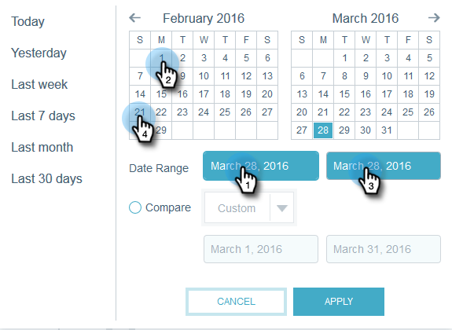
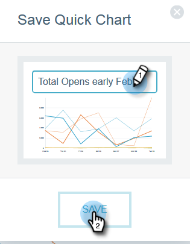
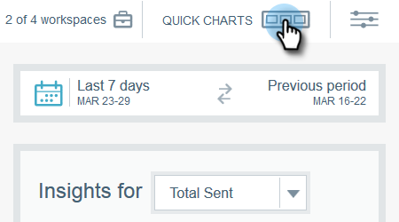
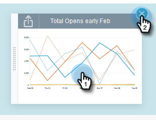
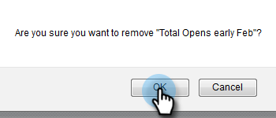

# Email Insights Quick Charts {#email-insights-quick-charts}

Quick Charts are thumbnails that you customize and save, providing a quick view of charts that you use the most.

## Create a New Quick Chart {#create-a-new-quick-chart}

In this example, we'll choose open rate for the first three weeks of February, 2016, in the states of California and Florida.

1. Click the date filter on the right of the Analytics screen.

   

1. Choose your desired date range.

   

1. When your date range is selected, click **Apply**.

   

1. The chart changes after your dates have been applied.

   

1. Click the first drop-down. Click to select your criteria (if it isn't selected already) and deselect any undesired criteria.

   

1. On the right-hand side of the chart, click the export icon and select **Save as Quick Chart**.

   

1. Name your Quick Chart and click **Save**.

   

   >[!NOTE]
   >
   >You can have up to 20 Quick Charts. They can be deleted and replaced.

1. Your new Quick Chart will appear with the others.

   

   And that's it!

   >[!TIP]
   >
   >To move any quick chart, simply click and drag it to the desired position.

## Delete a Quick Chart {#delete-a-quick-chart}

Want to delete one of your Quick Charts? It's easy!

1. Click the **Quick Charts** icon.

   

1. Hover over the desired chart, but do not click on it. Upon hovering, an X will appear. Click the **X**.

   

1. Click **Ok**.

   

   Your Quick Chart is now deleted. Told you it was easy.
