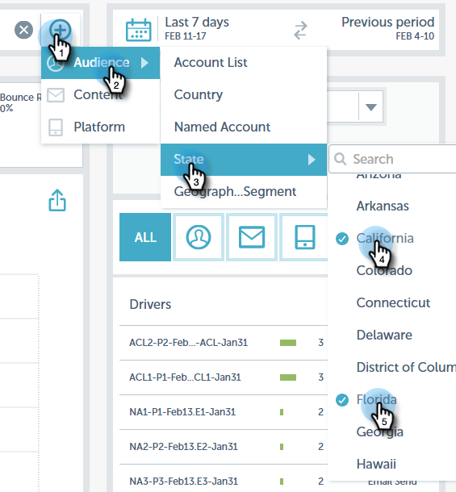
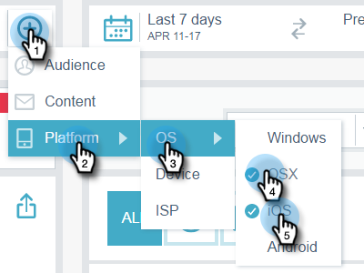
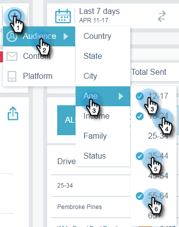
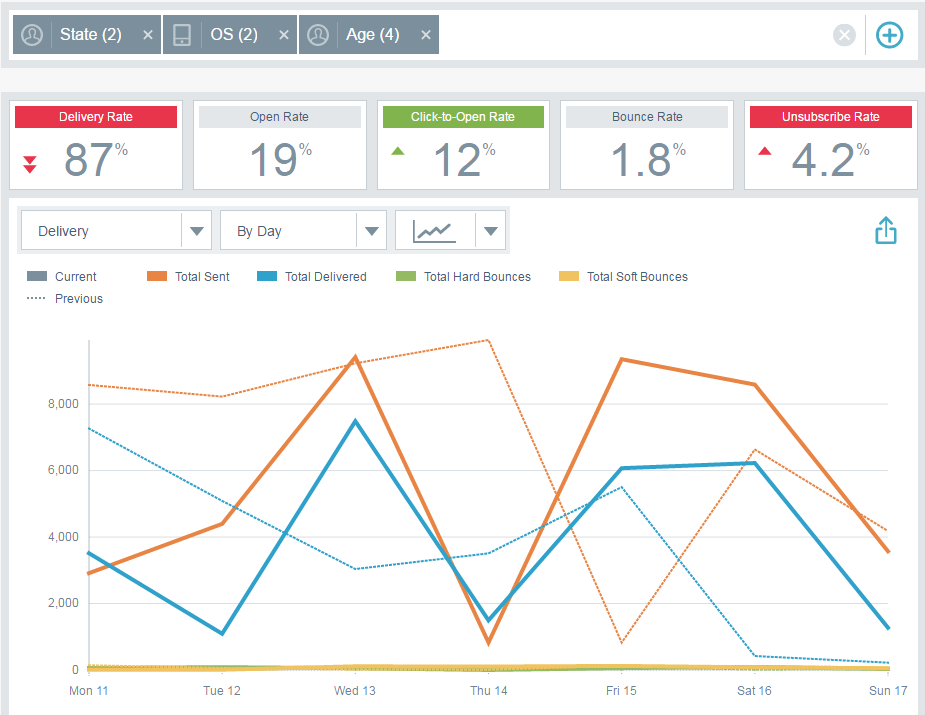
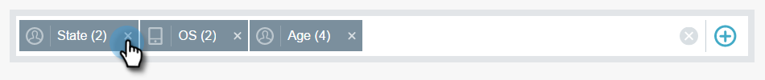
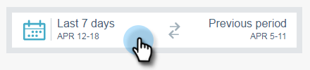
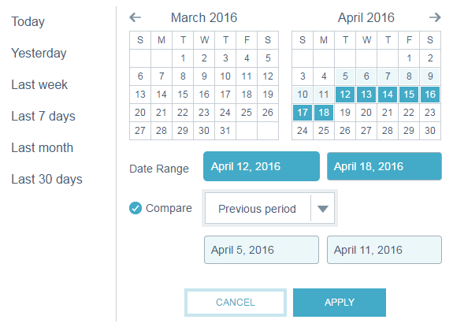
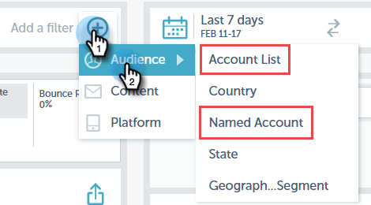

# Filtering in Email Insights {#filtering-in-email-insights}

In Email Insights, there are different ways to filter your data.

## Email Insights {#email-insights}

Click the + to start adding filters. Add as many as you'd like.

If you have more than one filter in the same category, they will merge and display the amount.

If you ever need to see which filters you've applied, simply click the filter. You can even add more there.

You can also add additional types of filters.

And even more filters!

The chart changes after each filter is applied.

To delete a category, click its X.

To clear all filters, click the X at the end of the filter bar.

For date-specific data, use date ranges.

Choose from common preset date ranges, select specific dates, even use the previous period for comparison.

>[!NOTE]
>
>Date ranges apply to both the Analytics page and Sends page. The **Compare** option is only applicable to the Analytics page, however.

## Account Based Marketing {#account-based-marketing}

If you use [Target Account Management](https://docs.marketo.com/display/DOCS/Account+Based+Marketing+Overview), there are filters specifically for you.

