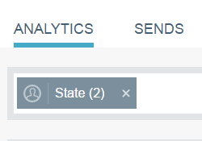
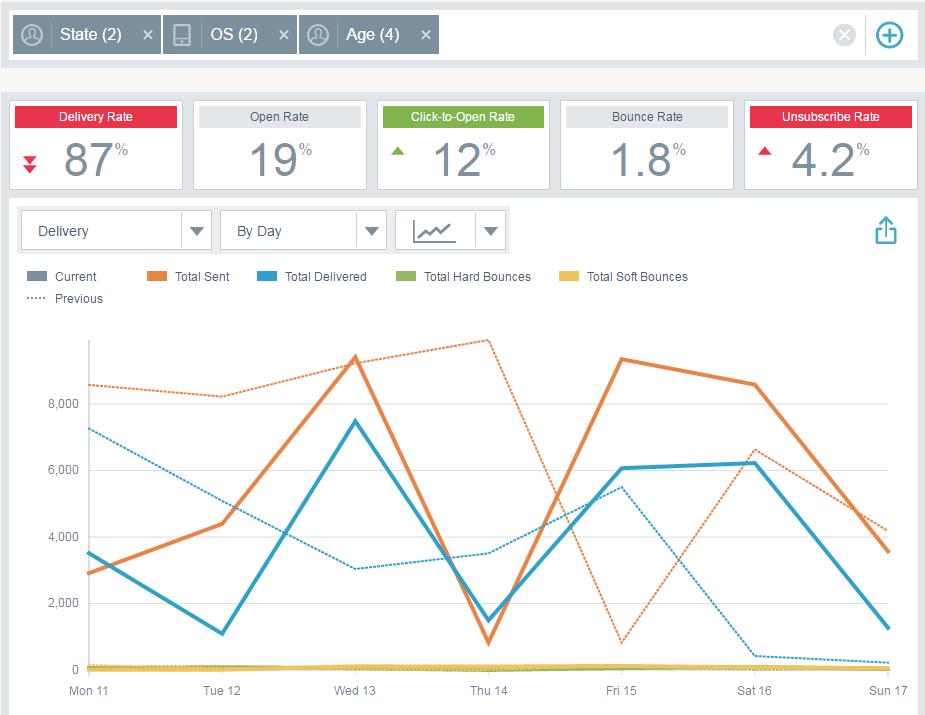

# Filtering in [!UICONTROL Email Insights] {#filtering-in-email-insights}

In [!UICONTROL Email Insights], there are different ways to filter your data.

## [!UICONTROL Email Insights] {#email-insights}

Click the + to start adding filters. Add as many as you'd like.

If you have more than one filter in the same category, they will merge and display the amount.

If you ever need to see which filters you've applied, simply click the filter. You can even add more there.

You can also add additional types of filters.

And even more filters!

The chart changes after each filter is applied.

To delete a category, click its X.

To clear all filters, click the X at the end of the filter bar.

For date-specific data, use date ranges.

Choose from common preset date ranges, select specific dates, even use the previous period for comparison.

>[!NOTE]
>
>Date ranges apply to both the [!UICONTROL Analytics] page and [!UICONTROL Sends] page. The **Compare** option is only applicable to the [!UICONTROL Analytics] page, however.

## Account Based Marketing {#account-based-marketing}

If you use [[!UICONTROL Target Account Management]](https://docs.marketo.com/display/DOCS/Account+Based+Marketing+Overview), there are filters specifically for you.

