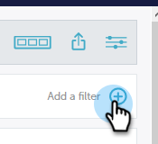
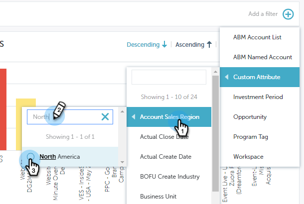
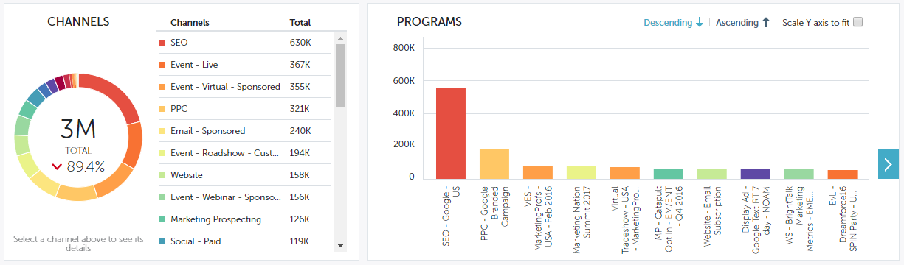
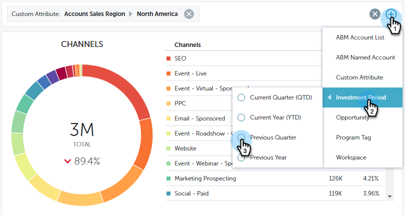
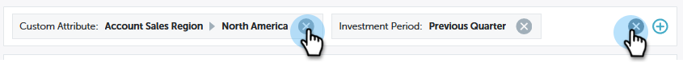

# Filtering in Performance Insights {#filtering-in-performance-insights}

Easily filter data to query specific information.

Click the + to start adding filters.

>[!NOTE]
>
>At this time, Custom Attributes are available in filters only to customers who have Revenue Cycle Analytics enabled.

Clicking a category reveals multiple sub-categories.

Choose a sub-category and search for/select a value.

The charts update to reflect the filter(s) selected.

You can add additional filters by following the same steps.

You can remove a filter at any time by clicking the X next to it. Remove all filters at once by clicking the X to the far right.

## Available Filters {#available-filters}

<table> 
 <tbody> 
  <tr> 
   <td colspan="1"><strong>ABM Account List</strong></td> 
   <td colspan="1">If you're using Marketo ABM, all of your account lists will be synced to MPI and be visible via the ‘ABM Account List’ filter. You can select an account list to filter results to those accounts.<a href="https://docs.marketo.com/display/public/DOCS/Account-Based+Web+Marketing+with+ABM" rel="nofollow">Learn more about ABM account lists.</a></td> 
  </tr> 
  <tr> 
   <td colspan="1"><strong>ABM Named Account</strong></td> 
   <td colspan="1">If you're using Marketo ABM, all of your named accounts will be synced to MPI and be visible via the ‘ABM Named Account’ filter. You can select a named account to filter results to those accounts.<a href="https://docs.marketo.com/x/eaCt" rel="nofollow">Learn more about ABM named accounts.</a></td> 
  </tr> 
  <tr> 
   <td colspan="1"><strong>Custom Attributes</strong></td> 
   <td colspan="1">
These are determined by you. All the fields <a href="/help/marketo/product-docs/reporting/revenue-cycle-analytics/revenue-tools/enabling-custom-field-sync-for-revenue-cycle-analytics.md" rel="nofollow">you enable</a> for the opportunity analysis can be filtered on in Performance Insights.
</td> 
  </tr> 
  <tr> 
   <td colspan="1">
<strong>Investment Period</strong>
</td> 
   <td colspan="1">
Program cost time frame.
</td> 
  </tr> 
  <tr> 
   <td colspan="1">
<strong>Opportunity Type</strong>
</td> 
   <td colspan="1">
Opportunity type as set up on the Opportunity object in your Salesforce (CRM) setup.
</td> 
  </tr> 
  <tr> 
   <td>
<strong>Program Tag</strong>
</td> 
   <td>
Tags are used to describe programs. You can make as many as you need, each with unique values. <a href="/help/marketo/product-docs/administration/tags/create-a-new-program-tag-and-tag-values.md" rel="nofollow">Learn how to work with program tags here.</a>
</td> 
  </tr> 
  <tr> 
   <td><strong>Workspace</strong></td> 
   <td>
Workspaces are separate areas in Marketo that hold marketing assets, like: programs, landing pages, emails, and more. <a href="/help/marketo/product-docs/administration/workspaces-and-person-partitions/understanding-workspaces-and-person-partitions.md" rel="nofollow">Learn more about workspaces here.</a>
</td> 
  </tr> 
 </tbody> 
</table>

>[!NOTE]
>
>In the Engagement dashboard, only program tags and workspace filters are available.
