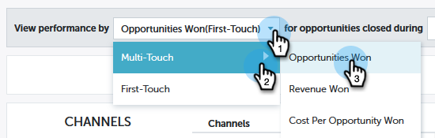
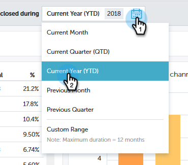
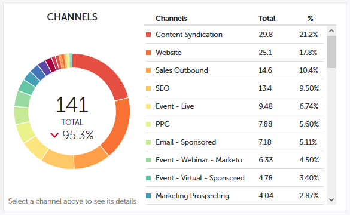
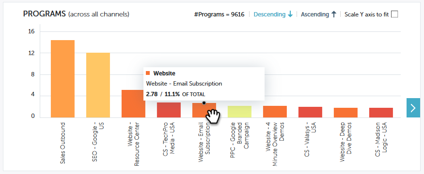

# [!UICONTROL Performance Insights] Contribution Overview {#performance-insights-contribution-overview}

In Marketo [!UICONTROL Performance Insights], the Contribution view is displayed by default.

Select the metric you want to view the performance by. In this example we'll look at opportunities won via **[!UICONTROL Multi-Touch]** in the _[!UICONTROL Revenue]_ dashboard.

Choose which period you'd like to see metrics for. In this example we're looking at the current year (year-to-date).

>[!NOTE]
>
>We have temporarily removed the "Previous Year" selection. You still have the option of viewing the entire previous year's performance data by using the **[!UICONTROL Custom Range]** selection.

Metrics are presented via two charts: doughnut and bar.

The doughnut chart shows the top ten channels for the metric you selected.

The bar chart displays program performance across all channels (ten programs at a time) for the metric you selected. To see more, click the arrow on the right to scroll to the next group.

>[!TIP]
>
>If you want the bars in the graph to scale up as you scroll through the groups, select the **[!UICONTROL Scale Y axis to fit]** checkbox.

Mouse over a bar to see additional details.

Select one or more channels in the doughnut chart, and all the programs associated with those channels appear in the bar chart to the right. Click the channel(s) again to deselect.

The data grid below functions like a spreadsheet, showing all available metrics under the chosen attribution model ([!UICONTROL First-Touch]/[!UICONTROL Multi-Touch]). The column containing the metric you chose is highlighted.

| **[!UICONTROL Opportunities Won]** |The portion of credit (in numeric value) the program received for influencing the won opportunity |
|---|---|
| **[!UICONTROL Revenue Won]** |The portion of credit (in monetary value) the program received for influencing the won opportunity |
| **[!UICONTROL Cost]** |Total cost of the program |
| **[!UICONTROL Cost Per Opportunity Won]** |The ratio of the cost of the program and the portion of credit (in numeric value) the program received for influencing the creation of new opportunities |
| **[!UICONTROL Revenue Won To Cost Ratio]** |The ratio of the portion of credit (in monetary value) the program received for influencing won opportunities and the cost of the program |

Expand a channel to see its top ten programs, with the remaining programs combined.

>[!NOTE]
>
>Clicking the checkbox next to a channel activate/deactivates it in the doughnut chart above.
