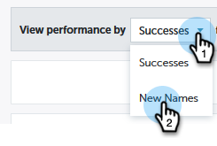

# [!UICONTROL Performance Insights] Dashboards {#performance-insights-dashboards}

Learn more about the available dashboards in MPI.

## [!UICONTROL Engagement] {#engagement}

The [!UICONTROL Engagement] dashboard helps you measure the effectiveness of your nurture and new name acquisition programs.

Measuring Audience Engagement

Choose the **[!UICONTROL Successes]** metric to measure audience engagement in your nurture programs. Success is a measure of meaningful interaction in Marketo.

The purpose of a program is to create a meaningful interaction with the person or prospect. Success is marked when a person reaches the status that achieves that goal. It can be attending a webinar, clicking a link in an email, or filling out a web form. Success varies depending on the program channel.

>[!NOTE]
>
>In a webinar program, there can be multiple statuses, such as: Invited, Registered, and Attended. Invited or Registered aren't meaningful interactions because people don't actually watch the webinar. Attended is considered success in this case.

Measuring New Name Acquisition

Choose the **[!UICONTROL New Names]** metric to measure the effectiveness of your new name acquisition programs.

>[!NOTE]
>
>All of your programs must be set up to set the acquisition program and acquisition date of leads in order for this dashboard to give you the best results.

## [!UICONTROL Pipeline] {#pipeline}

The [!UICONTROL Pipeline] dashboard shows channel performance by first-touch and multi-touch metrics.

<table> 
 <tbody> 
  <tr> 
   <td>
<strong>New Opportunities</strong>
</td> 
   <td>
The portion of credit the program received for influencing the creation of new opportunities. It may be a fraction if there were multiple leads involved.
</td> 
  </tr> 
  <tr> 
   <td>
<strong>Pipeline Created</strong>
</td> 
   <td>
The portion of credit (in monetary value) the program received for influencing the creation of opportunities. It may be a fraction of the total if there were multiple leads involved.
</td> 
  </tr> 
  <tr> 
   <td>
<strong>Pipeline Open</strong>
</td> 
   <td>
The portion of credit (in monetary value) the program received for influencing the creation of opportunities that are still open. It may be a fraction of the total if there were multiple leads involved.
</td> 
  </tr> 
  <tr> 
   <td>
<strong>Expected Revenue</strong>
</td> 
   <td>
The portion of credit (in monetary value) the program received for influencing the creation of opportunities. Expected Revenue is the Opportunity probability multiplied by the opportunity value. It may be a fraction if there were multiple leads involved.
</td> 
  </tr> 
  <tr> 
   <td>
<strong>Cost Per Opportunity Created</strong>
</td> 
   <td>
The portion of the cost of the program that influenced new opportunities divided by the total number of new opportunities created.
</td> 
  </tr> 
  <tr> 
   <td>
<strong>Pipeline Created to Cost Ratio</strong>
</td> 
   <td>
The portion of credit a program received for influencing the creation of new opportunities divided by the portion of the cost of the program that influenced the creation of opportunity.
</td> 
  </tr> 
 </tbody> 
</table>

## [!UICONTROL Revenue] {#revenue}

The [!UICONTROL Revenue] dashboard shows channel performance by first-touch and multi-touch metrics.

<table> 
 <tbody> 
  <tr> 
   <td>
<strong>Opportunities Won</strong>
</td> 
   <td>
The portion of credit a program received for influencing a won opportunity.
</td> 
  </tr> 
  <tr> 
   <td>
<strong>Revenue Won</strong>
</td> 
   <td>
The portion of credit (in monetary value) received for influencing a won opportunity.
</td> 
  </tr> 
  <tr> 
   <td>
<strong>Cost Per Opportunity Won</strong>
</td> 
   <td>
The portion of the cost of the program that influenced new opportunities divided by the total number of new opportunities created.
</td> 
  </tr> 
  <tr> 
   <td>
<strong>Revenue Won to Cost Ratio</strong>
</td> 
   <td>
The portion of credit (in monetary value) received for influencing a won opportunity divided by the portion of the cost of the program that influenced new opportunities.
</td> 
  </tr> 
 </tbody> 
</table>
