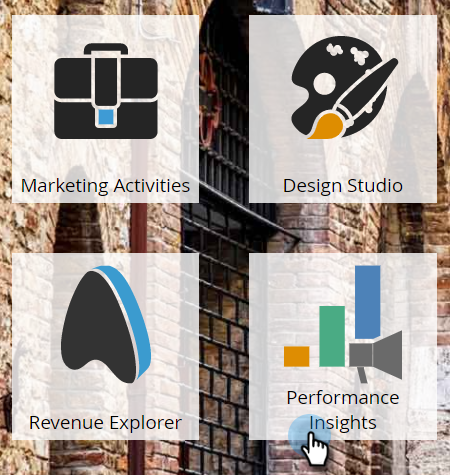
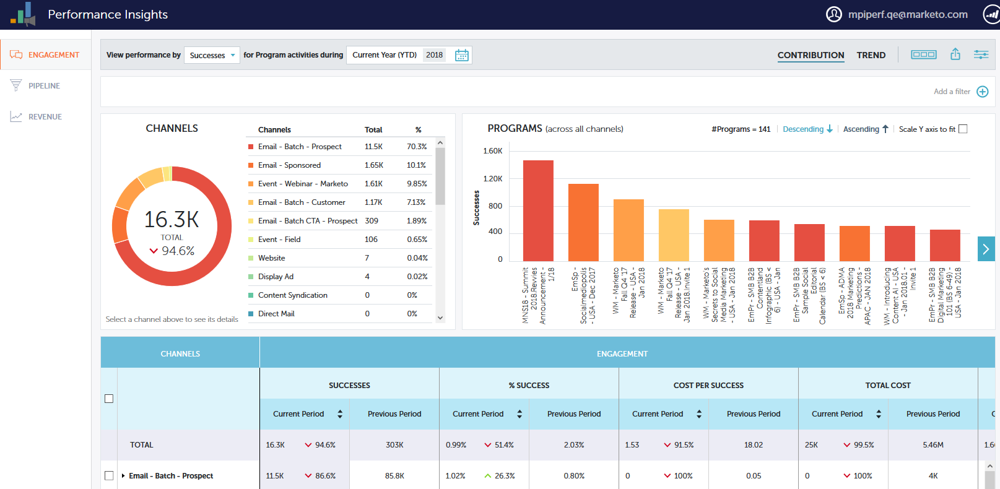
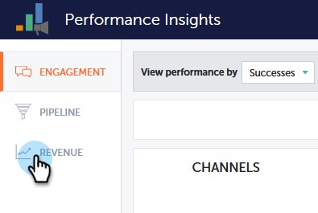
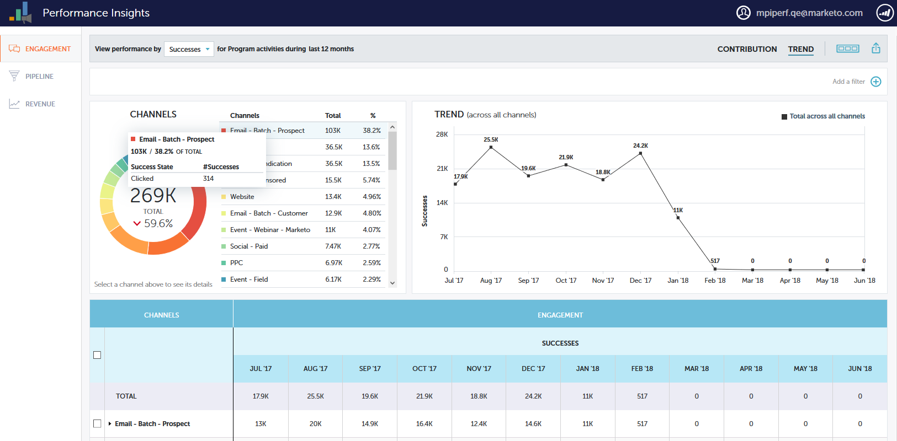
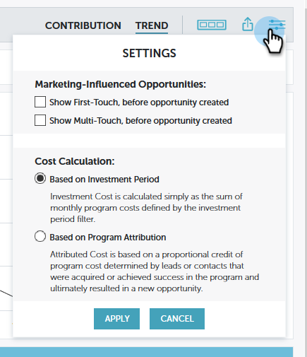
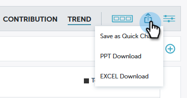

# Performance Insights Overview {#performance-insights-overview}

Marketo Performance Insights helps you optimize your channel mix for maximum effectiveness, as well as uncover long-term trends to spot consistent winning strategies.

>[!AVAILABILITY]
>
>Not all customers have purchased this feature. Please contact your Customer Success Manager for details.

Performance Insights loads data from (up to) the previous 24 months. This includes current year-to-date data, as well as the previous year's. So for example, on January 31, 2019 , MPI will load data from that month, and every month from 2018. On December 31, 2019, MPI will load data from every month of 2019 and 2018.

To access Performance Insights, click its icon on the Analytics home screen.

## Contribution {#contribution}

Evaluate Marketing's [contribution to revenue](/help/marketo/product-docs/reporting/performance-insights/performance-insights-contribution-overview.md) as a function of customer acquisition, influence, conversion, even installed base growth.

By default, the data displayed reflects performance by Engagement. You can switch to performance by Pipeline or Revenue simply by clicking on one of them.

## Trend {#trend}

Uncover [long-term trends](/help/marketo/product-docs/reporting/performance-insights/performance-insights-trend-overview.md) to spot consistent winning strategies.

## Settings {#settings}

In the Revenue and Pipeline dashboards, click the [Settings](/help/marketo/product-docs/reporting/performance-insights/performance-insights-settings.md) icon to set additional parameters.

## Export Data {#export-data}

You can export the data and charts in either PowerPoint or Excel. You can also save them as a [Quick Chart](/help/marketo/product-docs/reporting/performance-insights/performance-insights-quick-charts.md).

>[!NOTE]
>
>Export data to Excel to see data available for all channels (not just the top ten). PPT export will be WYSIWYG (output will mimic what you see on the screen).
