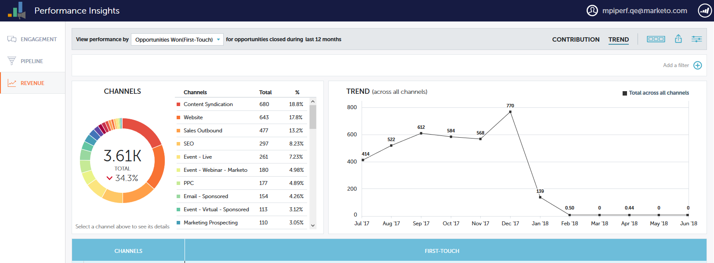
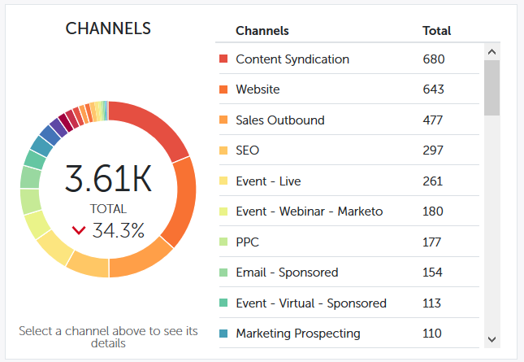
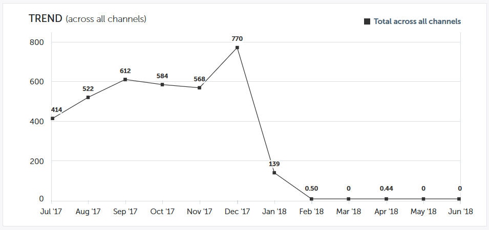
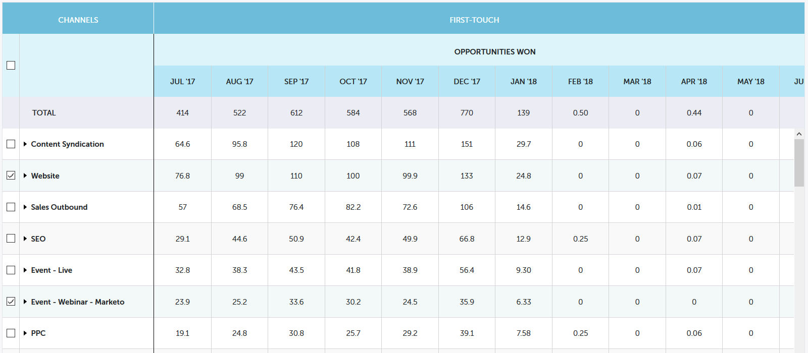
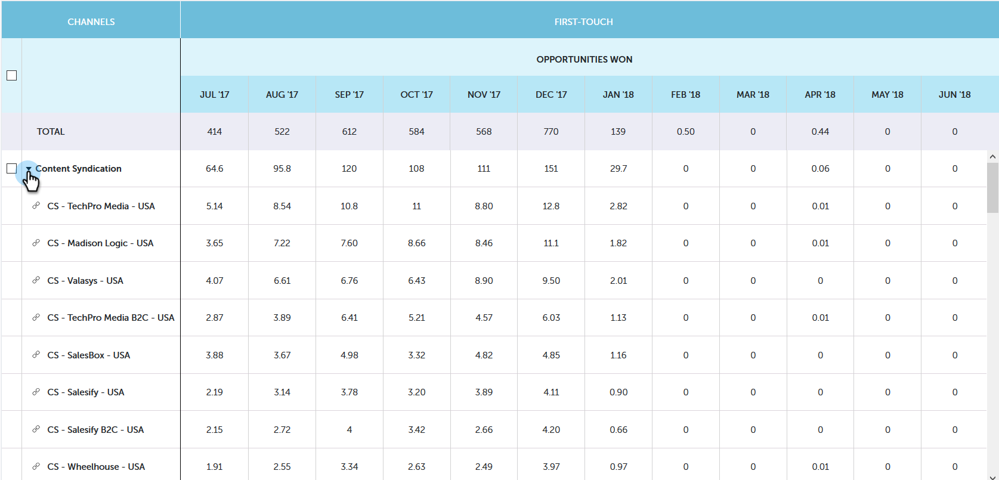

# Performance Insights Trend Overview {#performance-insights-trend-overview}

Trend shows channel performance of across a period of time.

Click the **Trend** tab to access this view.

## Trend {#trend}

Select the metric you want to view the performance by. In this example we'll look at opportunities won via [First Touch](/help/marketo/product-docs/reporting/revenue-cycle-analytics/revenue-tools/attribution/understanding-attribution.md).

Metrics are presented via two charts: doughnut and line.

The doughnut chart shows the top ten channels for the metric you selected.

The line chart displays the channel performance trend for the metric you selected over the past 12 months.

Select one or more channels and the line chart displays the channel trend. Click the channel(s) again to deselect.

The data grid below functions like a spreadsheet, showing all available trend data for the metric you selected for the last 12 months.

Expand a channel to see its top ten programs, with the remaining programs combined.

>[!NOTE]
>
>Clicking the checkbox next to a channel activate/deactivates it in the doughnut chart.
