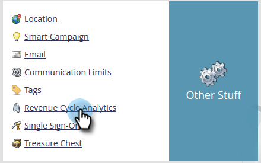
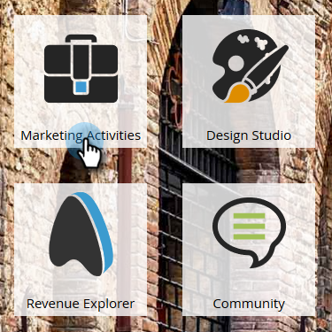
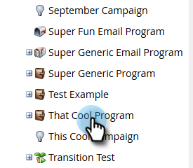
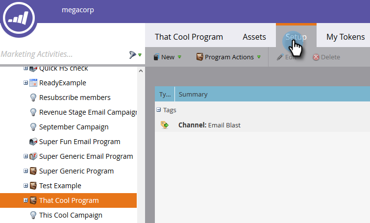
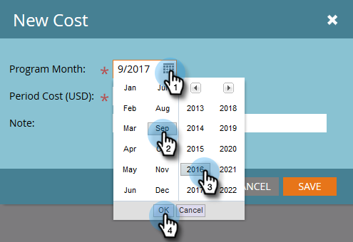
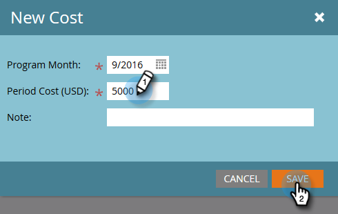
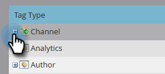
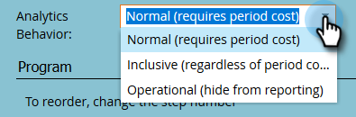
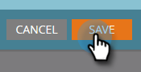

# Setting Up Performance Insights {#setting-up-performance-insights}

Follow the steps below to set up MPI.

## Opportunity Setup {#opportunity-setup}

1. Click **Admin**.

   

1. Click **Revenue Cycle Analytics**.

   

   >[!NOTE]
   >
   >If you do not have RCA, you'll need to select **Program Analysis** for Step 2.

1. Under Attribution, click **Edit**.

   

1. Attribution Settings displays.

   

   If Attribution is explicit, ensure the Opportunity Contact Role has been populated (either via the Opportunity Role endpoint or via CRM integration).

   If Attribution is implicit, ensure the company field on the lead/contact is the same as the Account Name of the opportunity.

   >[!NOTE]
   >
   >Ensure all of the opportunities have the appropriate fields populated:
   >
   >* Opportunity Amount
   >* Is Closed
   >* Is Won
   >* Creation Date (this may not be set in your case)
   >* Closed Date (this may not be set in your case)
   >* Opportunity Type

## Program Setup {#program-setup}

Update the program costs for at least 12 months. You can do this manually or using the program API. In this example we do it manually.

1. Click **Marketing Activities**.

   

1. Find and select your program.

   

1. Click the **Setup** tab.

   

1. Drag **Period Cost** onto the canvas.

   

1. Set the Program Month for at least 12 months ago and click **Ok**.

   

1. Set the period cost and click **Save**.

   

Next, review the analytics behavior to indicate whether particular channel should be included in analytics. Set the Analytics Behavior (Normal, Inclusive, Operational).

1. Click **Admin**.

   

1. Click **Tags**.

   

1. Click the **+** to expand the Channel list.

   

1. Double-click the desired channel.

   

1. Click the **Analytics Behavior** drop-down and select the desired behavior.

   

1. Set the success criteria.

   

1. Click **Save**.

   

## Tie the Program to the Person {#tie-the-program-to-the-person}

1. Make sure Acquisition Program and Acquisition Date have been set for each person in your database in order for First Touch Attribution to work.
1. Ensure your programs are setting success states for your people.

>[!NOTE]
>
>Changes made are not instantaneous. An overnight period is required before changes go into effect.
