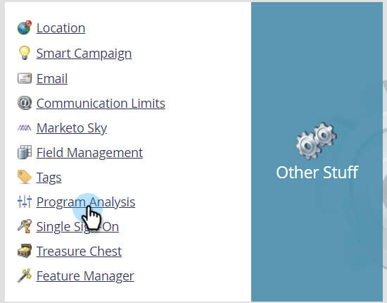
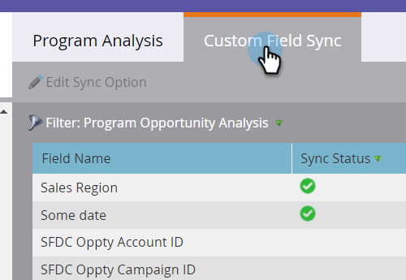
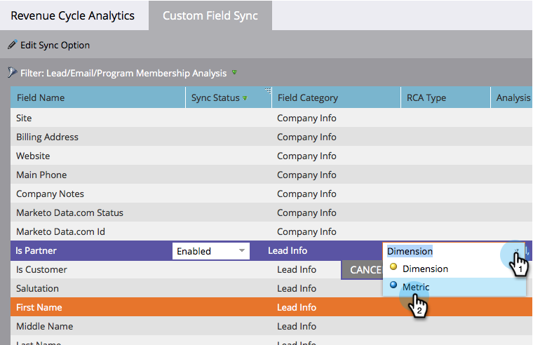

# Sync Custom Fields to [!UICONTROL Performance Insights] {#sync-custom-fields-to-performance-insights}

MPI [!UICONTROL Revenue] and [!UICONTROL Pipeline] dashboards can filter on custom Marketo fields. in order to do so you need to set the custom fields to be synced.

>[!NOTE]
>
>**Admin Permissions Required**

>[!NOTE]
>
>This article is only for users who do **not** have Revenue Cycle Analytics. If you do have RCA, please follow the steps in [this article](/help/marketo/product-docs/reporting/revenue-cycle-analytics/revenue-explorer/sync-custom-fields-to-the-revenue-explorer.md).

1. Go to the **[!UICONTROL Admin]** section.

   

1. Under Other Stuff, select **[!UICONTROL Program Analysis]**.

   

1. Click the **[!UICONTROL Custom Field Sync]** tab.

   

1. Select the field you want to enable sync for and click **[!UICONTROL Edit Sync Option]**.

   

   >[!IMPORTANT]
   >
   >Fields chosen need to be related to the Program Opportunity area only.

1. Change the **[!UICONTROL Sync Status]** to **[!UICONTROL Enabled]**.

   

1. Select the **[!UICONTROL RCA Type]** of your choice, then click **[!UICONTROL Save]**.

   

   >[!NOTE]
   >
   >Once enabled, the fields will be available in MPI the following day.
