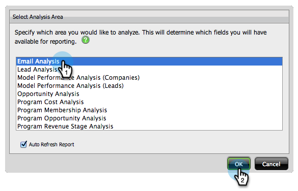
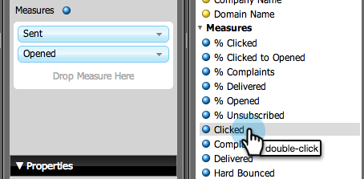

# Build an Email Analysis Report that Lists Leads {#build-an-email-analysis-report-that-lists-leads}

>[!AVAILABILITY]
>
>
>Not all customers have purchased this functionality. Contact your sales rep for details.

Follow these steps to create an Email Analysis report that will show you every lead that was sent a specific Email, this report will also include Click and Open stats. 1. Launch Revenue Explorer.

1. Click on New Report.

   

1. Select the Email Analysis area and click OK.

   

1. Find the Email Name yellow dot, right click it and select Filter.

   

1. Double click the email of your choice from the list and click OK.

   

1. Drag the Email Name yellow dot onto Columns.

   

   >[!TIP]
   >
   >There are many lead/company attributes that you can add as columns, check them out!

1. Find the Full Name yellow dot and drag it onto Rows. 

   

1. Now add the Measures you are interested in by double clicking them.

   

>[!NOTE]
>
>Depending on the amount of data you have this report might take a while to refresh.

Now that you are done your report should look something like this:   

Mission complete!
