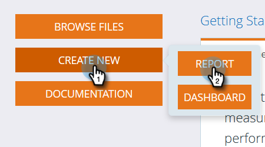
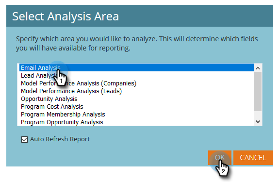
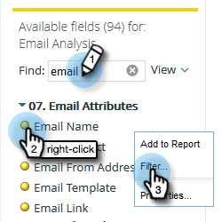
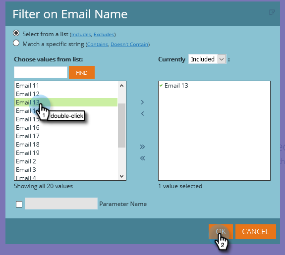
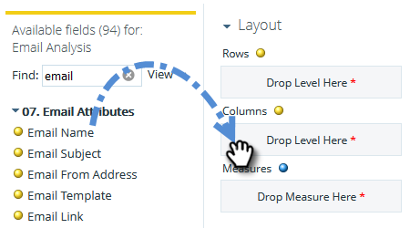
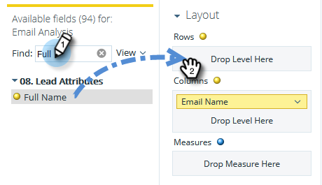
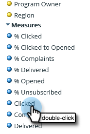

# Build an Email Analysis Report that Lists Leads {#build-an-email-analysis-report-that-lists-leads}

Follow these steps to create an Email Analysis report that will show you every lead that was sent a specific Email, this report will also include Click and Open stats.

>[!AVAILABILITY]
>
>Not everyone has purchased this feature. Please contact the Adobe Account Team (your Account Manager) for details.

>[!NOTE]
>
>The data engine backing Email Analysis RCA ignores greater than 12 clicks per person if they came from same email and campaign. Please take this into account when comparing Email Analysis reports to standard Marketo Analytics reporting.

1. Launch **Revenue Explorer**.

   

1. Click **Create New** then **Report**.

   

1. Select Email Analysis and click **OK**.

   

1. Find the Email Name yellow dot, right-click it and select **Filter**.

   

1. Double-click the email of your choice from the list and click **OK**.

   

1. Drag the **Email Name** yellow dot onto **Columns**.

   

   >[!TIP]
   >
   >There are many lead/company attributes that you can add as columns, check them out!

1. Find the **Full Name** yellow dot and drag it onto **Rows**.

   

1. Now add the **Measures** you are interested in by double-clicking them.

   

>[!NOTE]
>
>Depending on the amount of data you have this report might take a while to refresh.

Mission complete!
