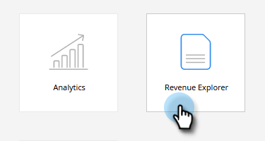
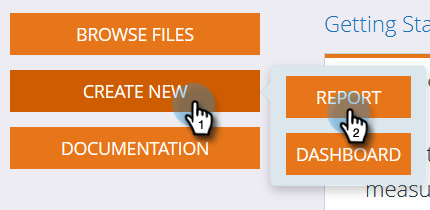
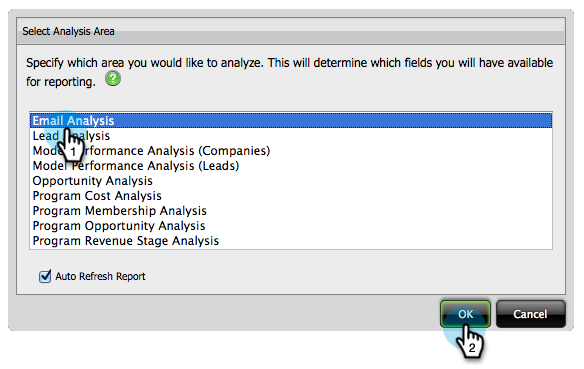
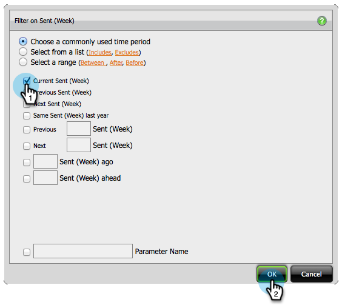
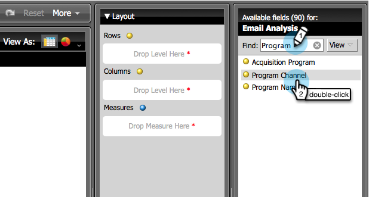
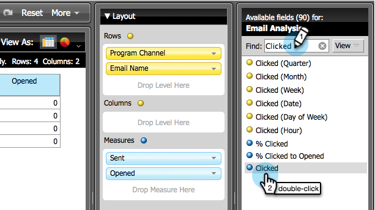
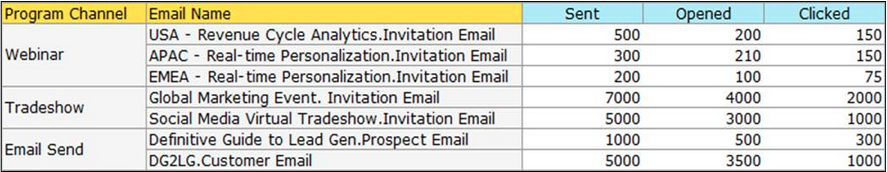

# Build an Email Analysis Report that Shows Program Information {#build-an-email-analysis-report-that-shows-program-information}

Follow these steps to create an Email Analysis Report that will show email information grouped by program channels.

>[!AVAILABILITY]
>
>Not all customers have purchased this functionality. Contact your Customer Success Manager for details.

1. Launch **[!UICONTROL Revenue Explorer]**.

   

1. Click **[!UICONTROL Create New]** and select **[!UICONTROL Report]**.

   

1. Select **[!UICONTROL Email Analysis]** area and click **[!UICONTROL OK]**.

   

1. Find the **[!UICONTROL Sent (Week)]** yellow dot and right click it. Click **[!UICONTROL Filter...]**.

   >[!NOTE]
   >
   >This will narrow down the timeframe of the report.

   

1. Check **[!UICONTROL Current Sent (Week)]** and click **[!UICONTROL OK]**.

   

1. Find and double click the **[!UICONTROL Program Channel]** yellow dot.

   

1. Find and double click the **[!UICONTROL Email Name]** yellow dot.

   

1. Find and double click the **[!UICONTROL Sent]**, **[!UICONTROL Opened]** and **[!UICONTROL Clicked]** blue dots.

   

   Great job! You should have a report that looks something like this:

   
