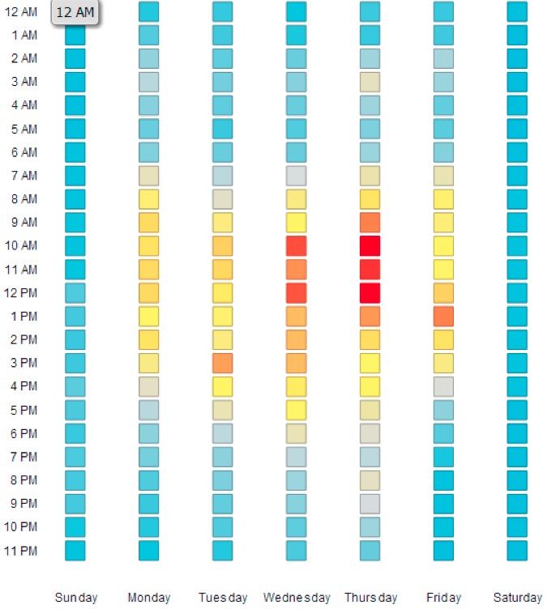
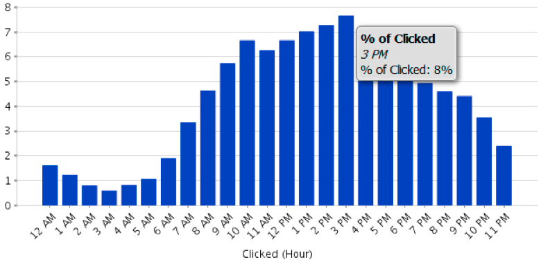
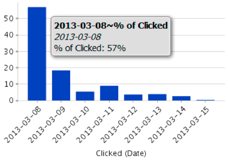
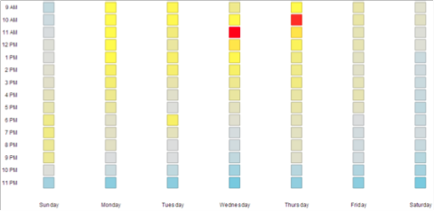
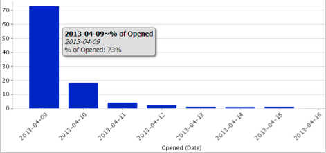
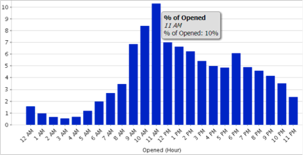

# Understanding the Email Analysis Area {#understanding-the-email-analysis-area}

The Email Analysis Area focuses on email metrics. This article introduces all of the reports available within it.

>[!AVAILABILITY]
>
>
>This is available to users with the Select Edition or  [Revenue Cycle Analytics](http://www.marketo.com/global-enterprise/marketo-revenue-cycle-analytics/) add-on. Contact your sales rep for details.

## Email Click Activity Heat Grid {#email-click-activity-heat-grid}

This report shows you what day of the week and time of the day your leads are clicking on emails. The greener the box the more clicks in that specific day and time. The current filter includes all emails sent in the last 7 days. Time is in CST.

## Email Clicked Time Distribution {#email-clicked-time-distribution}

This report shows you the percentage of total email clicks for each time of the day. The current filter includes all emails sent in the last 7 days. Time is in CST.

## Email Click Rate Decay {#email-click-rate-decay}

This report shows you what percentage of total email clicks happened on the same day an email is sent and subsequent days. The current filter includes all emails sent 7 days ago.

## Email Open Activity Heat Grid {#email-open-activity-heat-grid}

This report shows you what day of the week and time of the day your leads are opening emails. The greener the box the more opens in that specific day and time. The current filter includes all emails sent in the last 7 days. Time is in CST.

## Open Rate Decay {#open-rate-decay}

This report shows you what percentage of total email opens happened on the same day an email is sent and subsequent days. The current filter includes all emails sent 7 days ago.

## Open Time Distribution {#open-time-distribution}

This report shows you the percentage of total email opens for each time of the day. The current filter includes all emails sent in the last 7 days. Time is in CST.

## Sent Activity Heat Grid {#sent-activity-heat-grid}

This report shows you what day of the week and time of the day you are sending your emails. The greener the box the more sent emails in that specific day and time. The current filter includes all emails sent in the last 7 days. Time is in CST.

  

