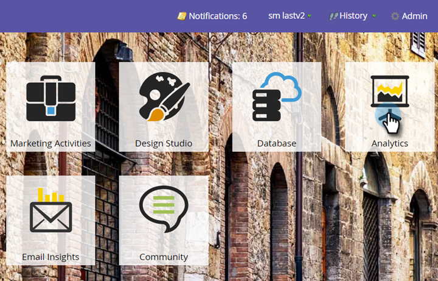
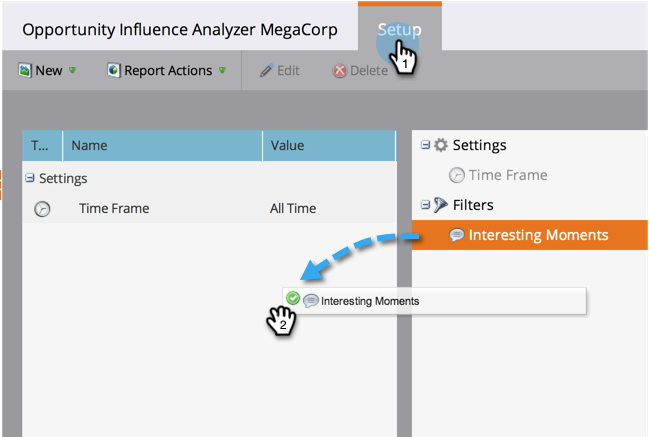
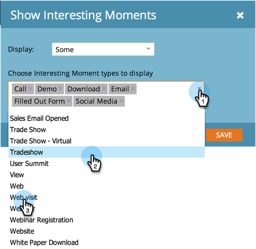
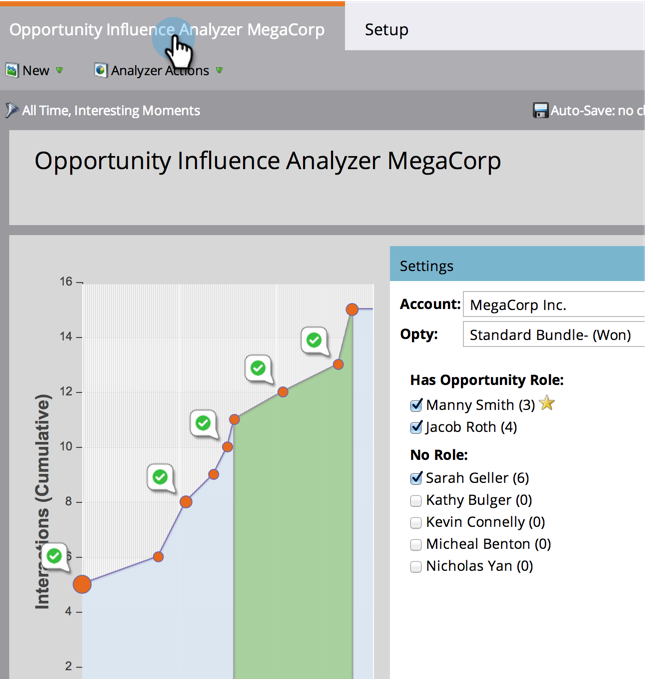

# Configure an Opportunity Influence Analyzer {#configure-an-opportunity-influence-analyzer}

Once you  [create an Opportunity Influence Analyzer](create-an-opportunity-influence-analyzer.md), you can configure the types of [interesting moments](/help/marketo/product-docs/marketo-sales-insight/msi-for-salesforce/features/tabs-in-the-msi-panel/interesting-moments/interesting-moments-overview.md) that are included.

>[!PREREQUISITES]
>
>* [Create an Opportunity Influence Analyzer](create-an-opportunity-influence-analyzer.md)

1. Click on Analytics.

   

1. Go to Analytics and select your Opportunity Influence Analyzer.

   

   If there are too many interesting moments in the analyzer graph, you can reduce them by deselecting people in the **Settings** panel, or by reducing the types of interesting moments.

1. To configure which types of interesting moments to include, go to the Setup tab and drag in the Interesting Moments filter.

   

1. Choose whether to show All, None, or Some.

   

1. If you choose Some, you can then choose which types to include.

   

1. Click each type of interesting moment you want. Then click Save.
1. Click the main tab to see the history of the opportunity with just the selected types of interesting moment.

   

>[!NOTE]
>
>For other analyzers, see [Basic Reporting](http://docs.marketo.com/display/docs/basic+reporting).

>[!MORELIKETHIS]
>
>* [Tell the Marketing Story with an Opportunity Influence Analyzer](tell-the-marketing-story-with-an-opportunity-influence-analyzer.md)
