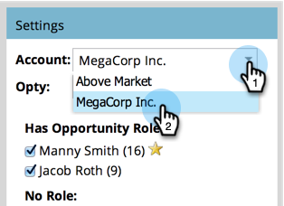
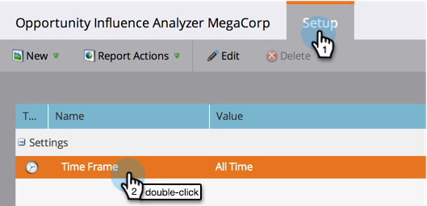
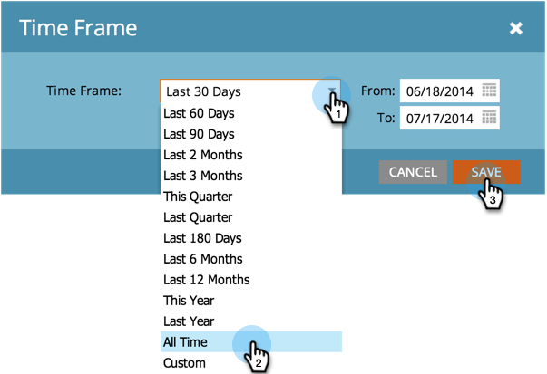

# Create an Opportunity Influence Analyzer {#create-an-opportunity-influence-analyzer}

Use the Opportunity Influence Analyzer to show marketing's contribution to an important deal. See your program and event successes, as well as interesting moments, in the life of an opportunity.

>[!NOTE]
>
>**Reminder**
>
>To get good intel from an Opportunity Influence Analyzer, ensure that your contacts are attached to the opportunities in your CRM.

1. Click **Analytics**.

   

1. Click **Opportunity Influence Analyzer**.

   

1. Select the account from the **Settings** panel.

   

   >[!NOTE]
   >
   >If you receive a warning that there were no activities during the time frame, just click **Close**. We'll come back to that after the next step.

1. Select the opportunity in that account.

   

1. Set the time period. Click the **Setup** tab and double-click **Time Frame**.

   

1. Select the time period of the opportunity you wish to analyze and click **Save**.

   

   >[!TIP]
   >
   >
   >In most cases, **All Time** is the simplest choice.

1. You're there! Click the main tab to see the interesting moments and successes involved in the opportunity.

   

>[!TIP]
>
>You can also watch a video about the Opportunity Influence Analyzer in [Marketo University](https://learn.marketo.com). (It looks a little different now, but there's still a lot to learn!)

>[!MORELIKETHIS]
>
>* [Tell the Marketing Story with an Opportunity Influence Analyzer](tell-the-marketing-story-with-an-opportunity-influence-analyzer.md)
>* [Configure an Opportunity Influence Analyzer](configure-an-opportunity-influence-analyzer.md)
>

>[!NOTE]
>
>**Deep Dive**
>
>For other analyzers, see [Basic Reporting](http://docs.marketo.com/display/docs/basic+reporting).

