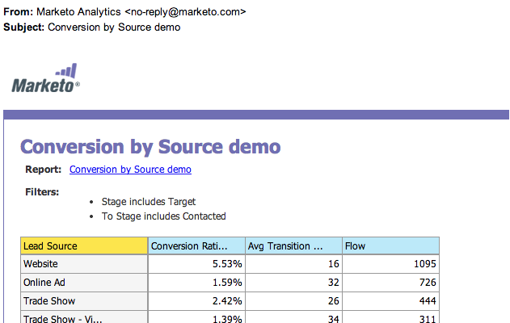

# Export Opportunity Influence Analyzer Data {#export-opportunity-influence-analyzer-data}

To receive updates from your Revenue Cycle Explorer reports, and to share them, you can subscribe any email address to an existing report.

1. Go to **[!UICONTROL Analytics]** and select **[!UICONTROL New]** > **[!UICONTROL New Report Subscription]**.

   

   >[!NOTE]
   >
   >To subscribe to a basic report that you created in a program, see [Subscribe to a Basic Report](/help/marketo/product-docs/reporting/basic-reporting/report-subscriptions/subscribe-to-a-basic-report.md).

1. For **[!UICONTROL Report Source]**, select **[!UICONTROL Revenue Explorer]**.

   

1. Navigate the folder tree and select the report.

   

1. Enter the email address(es) and set the frequency of the report emails.

   

   >[!NOTE]
   >
   >Anyone can unsubscribe from the report in the email they receive.

1. Your subscription is set! If you included your own email address, you'll receive the report in email.

   

>[!MORELIKETHIS]
>
>Learn how to [manage all your report subscriptions](/help/marketo/product-docs/reporting/basic-reporting/report-subscriptions/manage-report-subscriptions.md) in one place.
