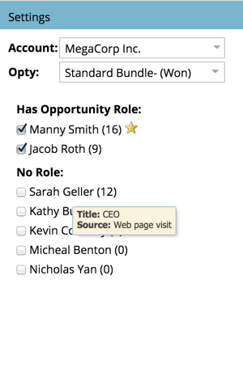
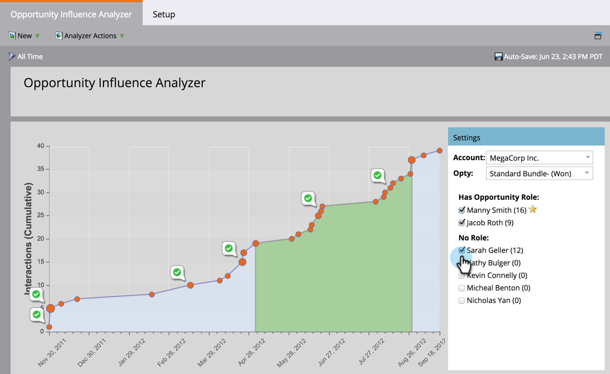
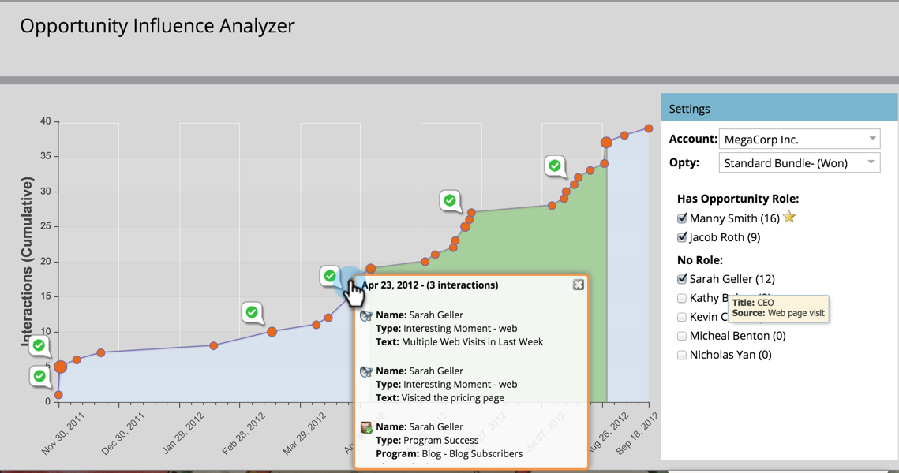

# Tell the Marketing Story with an Opportunity Influence Analyzer {#tell-the-marketing-story-with-an-opportunity-influence-analyzer}

Use an Opportunity Influence Analyzer to illustrate marketing's role in important opportunities. Show how marketing influenced an opportunity, from first touch to opportunity creation and win, and beyond.

>[!PREREQUISITES]
>
>* [Create an Opportunity Influence Analyzer](create-an-opportunity-influence-analyzer.md)
>

1. Go to **Analytics** and select the **Opportunity Influence Analyzer**.

   

   The Opportunity Influence Analyzer is a visual representation of the interactions and program and event successes involved in that opportunity. Let's explore the graph:

    * **Orange dots** represent [interesting moments](https://community.marketo.com/MarketoArticle?id=kA050000000LA1oCAG) in the opportunity (emails opened, tradeshow booth visits, whitepaper downloads, etc.). Bigger dots indicate more interactions.
    
    * `     
    
      ` **Binder icons** indicate [program](https://community.marketo.com/MarketoDeepDive?id=kA5500000008QO6CAM) successes.
    
    * **  Calendar icons** indicate [event](https://community.marketo.com/MarketoDeepDive?id=kA5500000008QNwCAM) successes.
    
    * **Opportunity period**. The green area represents the opportunity itself, from opportunity creation to opportunity close (won or lost). 
    * **Opportunity life cycle**. The gray areas before and after the green opportunity period show the interactions that led to and followed the opportunity.

   The **Settings** panel lists the people from the account:

    * The **number in parentheses** is the number of interactions with that contact.
    * The **yellow star** indicates the primary contact.

1. Hover over a name to see that person's job title and the source of their involvement with the opportunity.

   

1. Select the checkbox to include that person's interactions in the graph.

   

   The graph auto-adjusts to display their interactions in the opportunity. In this example, we see immediately that MegaCorp CEO Sarah Geller was deeply involved in the opportunity, even though she had no role assigned in the CRM for the opportunity. 

1. Click an orange dot to see interaction details.

   

   In our example, we learn that CEO Sarah Geller visited the website multiple times and even subscribed to the blog. This suggests MegaCorp's interest in the opportunity was driven, in large part, by Marketing programs and assets.

   Click more orange dots along the timeline to fill out the story of the events, programs, and interesting moments that helped create and close the opportunity.

   >[!MORELIKETHIS]
   >
   >
   >
   >    
   >    
   >    * [Configure an Opportunity Influence Analyzer](configure-an-opportunity-influence-analyzer.md)
   >    
   >    
   >
   >
   >    
   >    
   >    * [Basic Reporting](http://docs.marketo.com/display/docs/basic+reporting)
   >    
   >

