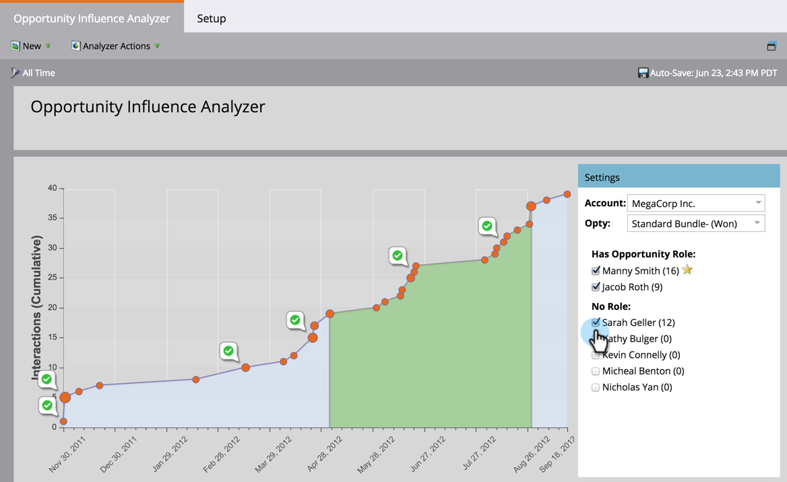

# Understanding the Opportunity Influence Analyzer {#understanding-the-opportunity-influence-analyzer}

Each opportunity is a story. Where did you meet the lead? What marketing opportunities affected them during the marketing/sales process?

The Opportunity Influence Analyzer lets you see the whole story. It's even available in Sales Insight!

**Notice the green checks.** They indicate program success for one of the names checked on the right. The green area indicates the beginning and end of the opportunity.

>[!NOTE]
>
>Analyzer data is updated nightly, not in real time.

Use the controls on the right to add/remove people from the chart or switch to different accounts or opportunities.  

#### Identifying Unique Accounts {#identifying-unique-accounts}

Marketo uses the CRM ID to uniquely identify accounts.

Previously, accounts with the same name were considered to be one account. For example, if Washington High School was the account name, and there were several accounts named Washington High School across the United States, we combined them all into a single account. This was inaccurate, as each school was an independent entity.

If you want to retain this behavior, please consider deduplicating your data in your CRM system.

>[!TIP]
>
>Every time you close a deal, find it in this analyzer the next day. Share it with the sales rep. They will realize all the hard work you do - plus, you can ask why certain people "look" influential but don't have a role assigned in the CRM.

>[!NOTE]
>
>**Related Articles**
>
>* [Tell the Marketing Story with an Opportunity Influence Analyzer](tell-the-marketing-story-with-an-opportunity-influence-analyzer.md)
>* [Create an Opportunity Influence Analyzer](create-an-opportunity-influence-analyzer.md)
>

