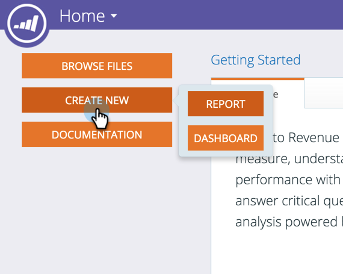
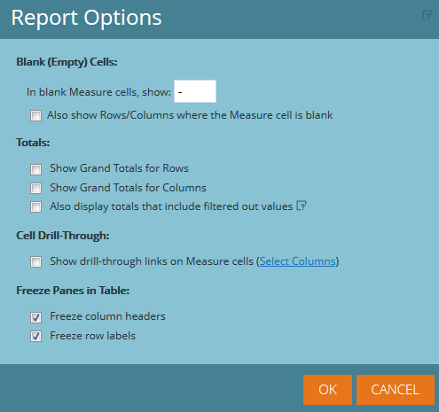

# Advanced Program Reporting Overview {#advanced-program-reporting-overview}

**Revenue Cycle Explorer** includes several areas of analysis and a wide array of new metrics that allow you to measure program effectiveness.

There are lots of goodies in here. Let's check them out!

## What's an Analysis Area? {#whats-an-analysis-area}

Analysis areas each contain different data sets and metrics within Revenue Explorer. Each area relates to the reporting subject you have chosen to view.

## Program Analysis Areas {#program-analysis-areas}

* **[Program Cost Analysis](understanding-the-program-cost-analysis-area.md)** - See the ROI for all of your programs.

* **[Program Membership Analysis](understanding-the-program-membership-analysis-area.md)** - See results by channel, participation, success criteria, etc.

* **[Program Opportunity Analysis](understanding-the-program-opportunity-analysis-area.md)** - Opportunities generated based on distribution, their revenue, and ROI.

* **[Program Revenue Stage Analysis](understanding-the-program-revenue-stage-analysis-area.md)** - New names that have reached particular success stages within your revenue cycle model.

## Program Analyzers {#program-analyzers}

* **Program Analyzer** - Quickly identify programs that are successful or not, and focus your resources appropriately.

* **Opportunity Influence Analyzer** - Prove Marketing's contribution by measuring the impact of programs and key engagements that generated opportunities.

## Report Options {#report-options}

In each report there are several options available to help you customize the experience.

>[!CAUTION]
>
>While you have the option to show Rows/Columns where the Measure cell is left blank (first checkbox), we advise against doing that as it could slow processing way down, and may even time out the report.

>[!NOTE]
>
>The data in Revenue Cycle Explorer updates nightly from your instance of Marketo. Therefore, any changes in your person and account activity inside of Marketo will be reflected the following business day in Revenue Cycle Explorer.

Familiarizing yourself with Revenue Analytics will give you full insight into your programs and their impact.
