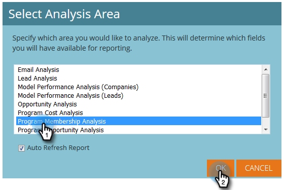
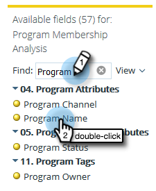
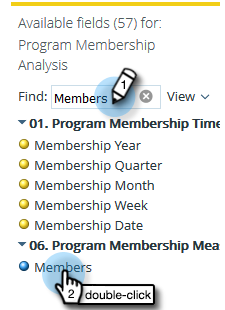
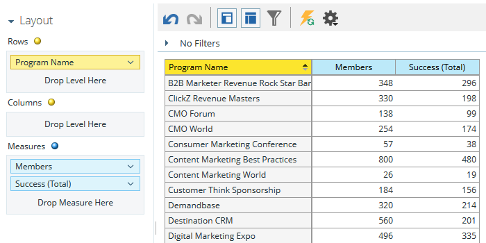
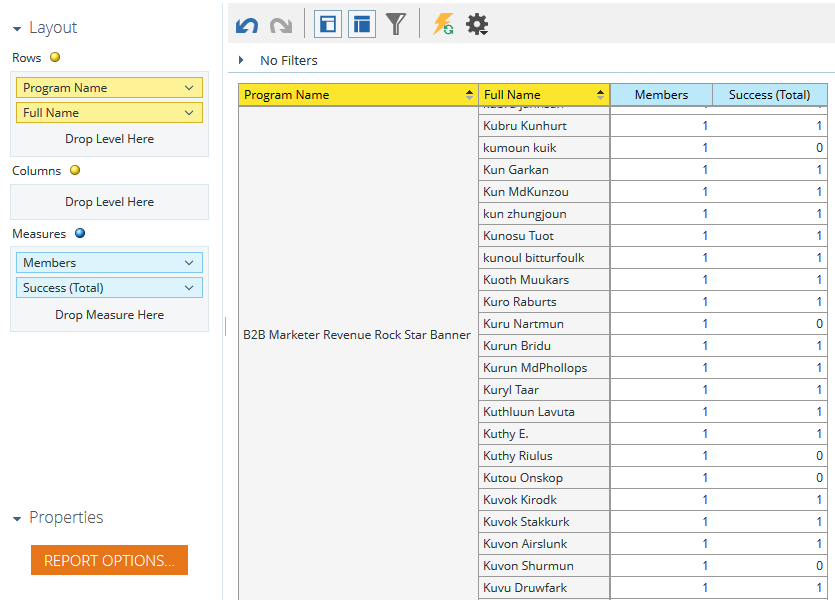

# Build a Program Membership Analysis Report that Lists Leads {#build-a-program-membership-analysis-report-that-lists-leads}

Follow these steps to create a Program Membership Analysis report that will show you all program member names.

>[!NOTE]
>
>**Availability**
>
>Not all customers have purchased this functionality. Contact your sales rep for details.

1. Launch Revenue Explorer.

   

1. Click Create New then Report.

   

1. Select Program Membership Analysis and click OK.

   

1. Find and double-click the Program Name yellow dot. 

   

1. Find and double-click the Members blue dot.

   

1. Find and double-click the Success (Total) blue dot.

   

See how easy that was?

You can quickly add a lead attribute such as **Full Name** to see who the members are.

>[!TIP]
>
>There are plenty of lead/company attributes to pick from. Check them out!

1. Find and double-click the Full Name yellow dot.

   

There you have it!

