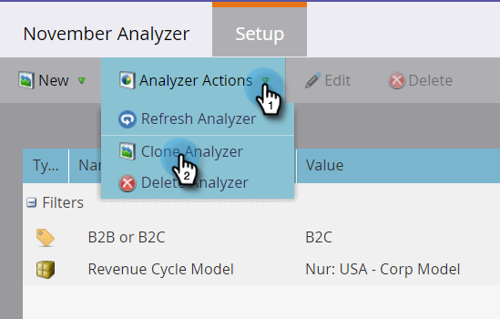

# Clone a Program Analyzer {#clone-a-program-analyzer}

After you've saved an analyzer, it's easy to clone it to create a new one. Then, go in and edit the new one if it needs any changes.

1. Click the **Analytics **tile.

   

1. Click the **Program Analyzer** tile.

   

1. While your saved analyzer is open, open the Analyzer Actions drop-down and select **Clone Analyzer**.

   

1. Select the location for the cloned analyzer from the **Clone To** and **Folder** drop-downs.

   

1. Name the cloned analyzer and click **Clone**.

   

1. Now, you've got two identical analyzers with different names. Open the clone to make any necessary changes.

   

   >[!MORELIKETHIS]
   >
   >
   >    
   >    
   >    * [Create a Program Analyzer](create-a-program-analyzer.md)
   >    
   >

