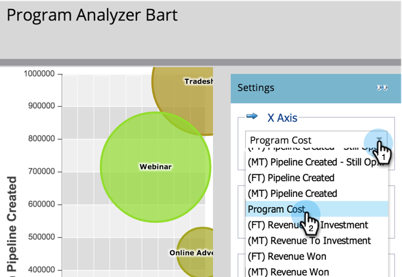
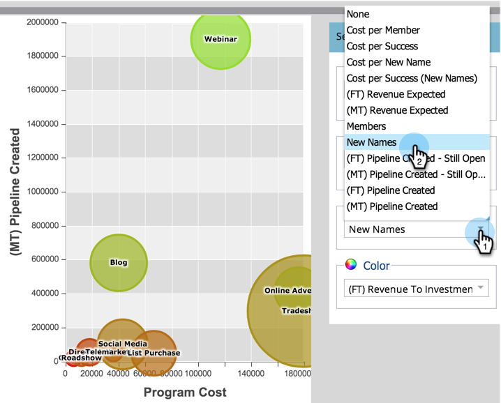
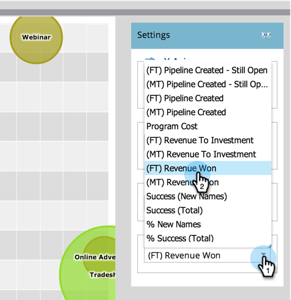
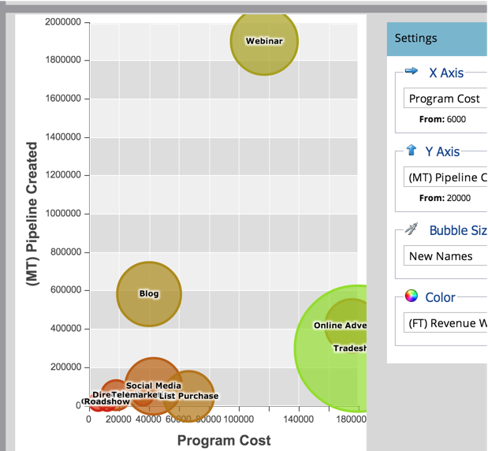
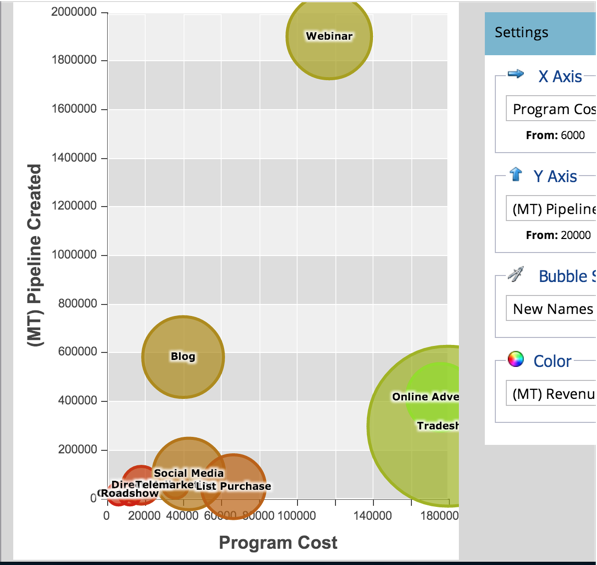

# Compare Channel Effectiveness with the Program Analyzer {#compare-channel-effectiveness-with-the-program-analyzer}

Use the Program Analyzer to compare channel costs, member acquisition, pipeline, revenue and more, to identify your most and least effective channels.

>[!PREREQUISITES]
>
>[Create a Program Analyzer](/help/marketo/product-docs/reporting/revenue-cycle-analytics/program-analytics/create-a-program-analyzer.md)

1. Click on **Analytics** in **My Marketo**.

   

1. Select your **Program Analyzer**.

   

1. Change the View to **By Channel**.

   

1. Use the **X Axis** drop-down to choose a metric for the horizontal axis. Let's start with **Program Cost**.

   

1. Use the Y Axis drop-down to choose a metric for the vertical axis. Here, we'll go with **(FT) Pipeline Created**.

   

   >[!NOTE]
   >
   >Many of the metrics you can choose in the program analyzer are available with first-touch (FT) and multi-touch (MT) calculations. It is important to understand the [difference between FT and MT attribution](/help/marketo/product-docs/reporting/revenue-cycle-analytics/revenue-tools/attribution/understanding-attribution.md).

1. Use the **Y Axis** drop-down to choose **(MT) Pipeline Created**.

   

   In this multi-touch attribution view, we see that the Webinar channel has more influence on pipeline created and costs less than the Tradeshow and Online Advertising channels.

   Now let's add two more dimensions!

1. Use the **Bubble Size** drop-down to select an additional measure, like **New Names**.

   

1. Watch how the graph changes.

   

   We see that the Webinar channel shrinks, as measured by **New Names**. We can conclude that, while it has many members, it is less effective at generating new leads than the Tradeshow channel.

1. Finally, use the Color drop-down to add the fourth dimension. Let's select **(FT) Revenue Won**.

   

1. Watch the colors change in your graph.

   

   From the colors, we learn that the Tradeshow channel, the greenest bubble, has influenced the greatest revenue won, as measured by first-touch attribution.

1. Now, if we change the Color metric to **(MT) Revenue Won**, we see that the Online Advertising channel, now the greenest, influenced more revenue -over time_ than the Webinar and Tradeshow channels.

   

In our example, we see that the Tradeshow channel is both the most expensive (furthest to the right) and most successful (highest on the Y axis) when measuring pipeline created by first touch. Now, let's consider each channel's pipeline created as measured by multi-touch attribution.

>[!TIP]
>
>The examples in these steps measure effectiveness based on pipeline created. Use theY Axis drop-down to select other ways to measure channel effectiveness, like New Names, Members, Cost per Success, etc.

>[!MORELIKETHIS]
>
>* [Explore Program & Channel Details with the Program Analyzer](/help/marketo/product-docs/reporting/revenue-cycle-analytics/program-analytics/explore-program-and-channel-details-with-the-program-analyzer.md)
>* [Compare Program Effectiveness with the Program Analyzer](/help/marketo/product-docs/reporting/revenue-cycle-analytics/program-analytics/compare-program-effectiveness-with-the-program-analyzer.md)
