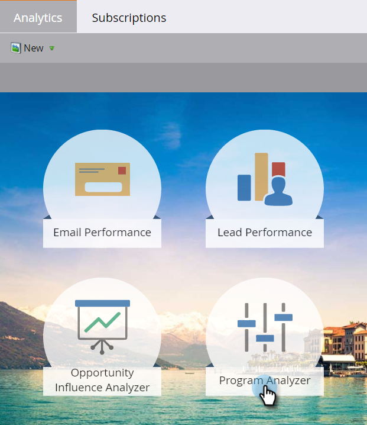
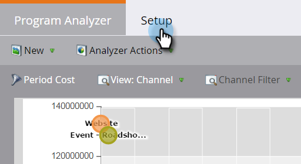
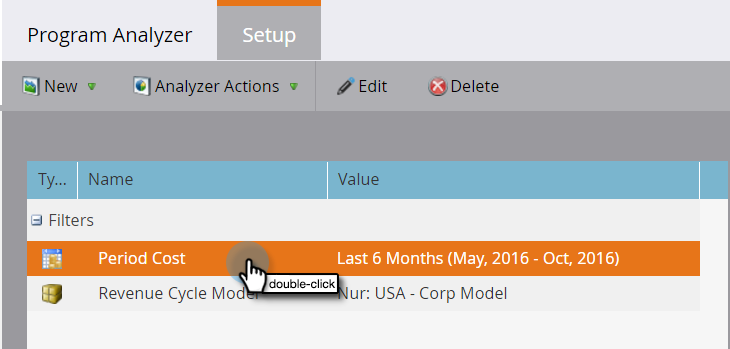
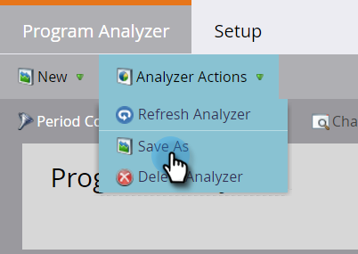
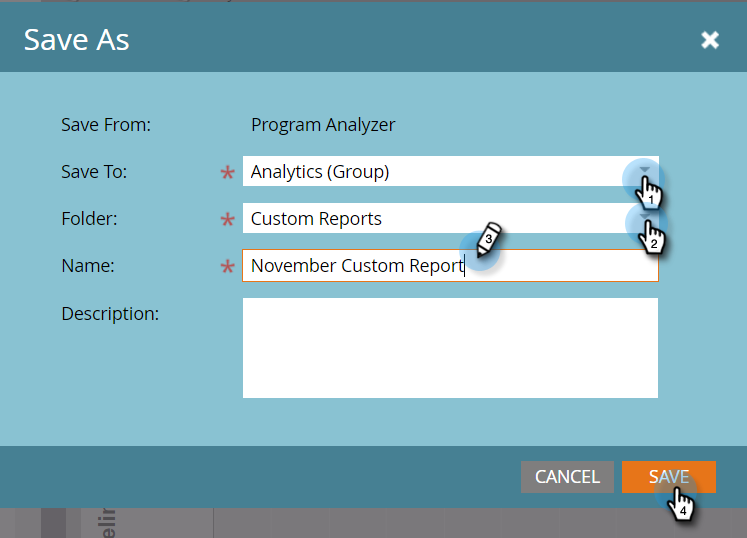

# Create a Program Analyzer {#create-a-program-analyzer}

Discover which programs and channels are giving you the biggest bang for your marketing buck. Use the program analyzer to scrutinize and compare every cost and return in detail, by program or by channel.

>[!NOTE]
>
>To get good data from a program analyzer, make sure your CRM contacts have roles in the opportunities, and that your Marketo programs are fully set up, with [period costs](/help/marketo/product-docs/reporting/revenue-cycle-analytics/revenue-tools/define-period-costs.md), program statuses, and success defined.

>[!TIP]
>
>To make programs with no cost appear in the program analyzer, [set their period cost](/help/marketo/product-docs/reporting/revenue-cycle-analytics/revenue-tools/define-period-costs.md) to $0.

1. Click the **Analytics** tile.

   

1. Click the **Program Analyzer** tile.

   

1. The standard program analyzer appears. Make any changes to it you need.

   

1. Click the **Setup** tab to add and customize filters.

   

1. For example, to customize the Period Cost filter, double-click on it.

   

1. Select the time period you wish to analyze and click **Apply**.

   

   >[!TIP]
   >
   >To select a specific range, select **Custom** and use the **From** and **To** fields.

1. If you want to save your new custom analyzer, in the Analyzer Actions drop-down, select **Save As**.

   

1. Select the location where you want to save the custom analyzer, using the Save To and Folder drop-downs. Name the new custom analyzer. A description is optional. Click **Save**.

   

1. You've done it! Click the main tab to start exploring and comparing your programs and channels.

>[!NOTE]
>
>Many of the metrics you can choose in the program analyzer are available with first-touch (FT) and multi-touch (MT) calculations. It is important to understand the [difference between FT and MT attribution](/help/marketo/product-docs/reporting/revenue-cycle-analytics/revenue-tools/attribution/understanding-attribution.md).

>[!MORELIKETHIS]
>
>* [Compare Channel Effectiveness with the Program Analyzer](/help/marketo/product-docs/reporting/revenue-cycle-analytics/program-analytics/compare-channel-effectiveness-with-the-program-analyzer.md)
>* [Compare Program Effectiveness with the Program Analyzer](/help/marketo/product-docs/reporting/revenue-cycle-analytics/program-analytics/compare-program-effectiveness-with-the-program-analyzer.md)
>* [Explore Program & Channel Details with the Program Analyzer](/help/marketo/product-docs/reporting/revenue-cycle-analytics/program-analytics/explore-program-and-channel-details-with-the-program-analyzer.md)
>* [Clone a Program Analyzer](/help/marketo/product-docs/reporting/revenue-cycle-analytics/program-analytics/clone-a-program-analyzer.md)
