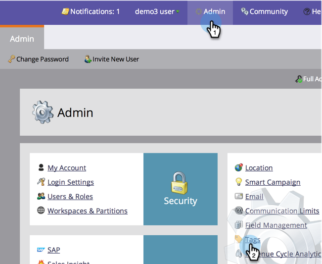
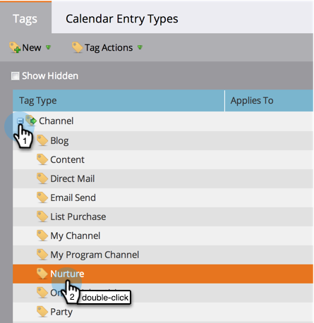

# Make a Program Without a Period Cost Available in Revenue Explorer and Analyzers {#make-a-program-without-a-period-cost-available-in-revenue-explorer-and-analyzers}

Program Period Costs allows you to define "How much money" and "When" for a program. This shows up in  [revenue cycle explorer](http://docs.marketo.com/display/docs/revenue+cycle+analytics) and  [analyzers](../../../../product-docs/reporting/revenue-cycle-analytics/opportunity-influence-analyzer/tell-the-marketing-story-with-an-opportunity-influence-analyzer.md). 

>[!NOTE]
>
>**Admin Permissions Required**

Some programs may need to be included even if they don't have a period cost. Although you can enter 0 for the period cost, we have made it easier to include these programs.

>[!NOTE]
>
>The Program Analyzer buckets Program Success by period cost. If there is no period cost available, Program Success will not be displayed, regardless of the analytics behavior of the program. If the analytics behavior is set up, data will display for opportunity metrics (pipeline opportunities, revenue won, etc.).

1. Under the Admin section, click on Tags.

   

1. Expand your Channels and double click the channel of your choice.

   >[!NOTE]
   >
   >**Reminder**
   >
   >All programs using this channel, regardless of period cost, will become available to revenue explorer and analyzers. This change will take effect the following day.

   

1. Change the Analytics Behavior to Inclusive and click Save.

   

>[!TIP]
>
>Did you notice the Operational option? This does the opposite. It excludes these programs regardless of period cost.

Nice job! Now any program using the modified channel will be included in revenue explorer and analyzers without the need for a period cost. 

>[!MORELIKETHIS]
>
>* [Override Analytics Behavior at the Program Level](override-analytics-behavior-at-the-program-level.md)
>

