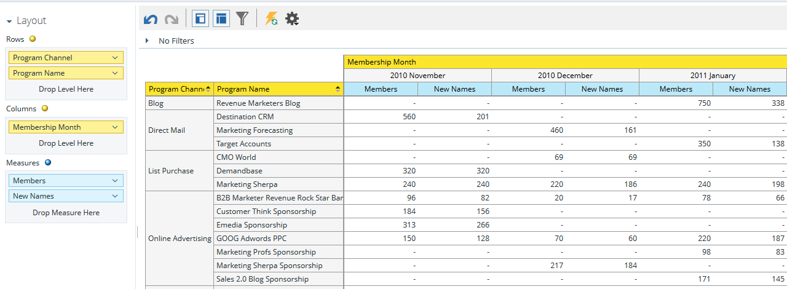

# Understanding the Program Membership Analysis Area {#understanding-the-program-membership-analysis-area}

The Program Membership Analysis area allows you to analyze the effectiveness of individual programs or to see summarized results by channel for a given period of time.

## Example Business Questions {#example-business-questions}

How many people participated in a program by channel in a given month?

How many people reached the success criteria for a given program?

How many new names did each program/channel generate per month?

## Program Membership Analysis Dimensions and Measures {#program-membership-analysis-dimensions-and-measures}

>[!NOTE]
>
>Yellow dots are dimensions and blue dots are measures.

### Membership {#membership}

| Measure |Description |
|---|---|
| % New Names |Percentage of leads acquired in a program |
| Members |Total leads in a program |
| New Names |Total new names acquired by a program |

### Program Attributes {#program-attributes}

| Dimension |Description |
|---|---|
| Program Channel |Program Channel |
| Program Name |Program Name |

### Program Membership Timeframe {#program-membership-timeframe}

| Dimension |Description |
|---|---|
| Year |Program Membership timeframe |
| Quarter |Program Membership timeframe |
| Month |Program Membership timeframe |
| Week |Program Membership timeframe |
| Date |Program Membership timeframe |

### Success {#success}

| Measure |Description |
|---|---|
| % Success (New Names) |Percentage of leads who were acquired by the program AND achieved success in the progression of the program |
| % Success (Total) |Percentage of leads who achieved success in the progression of a program |
| Success (New Names) |Total number of new names who achieved success in the progression of a program |
| Success (Total) |Total number of leads who achieved success in the progression of a program |
