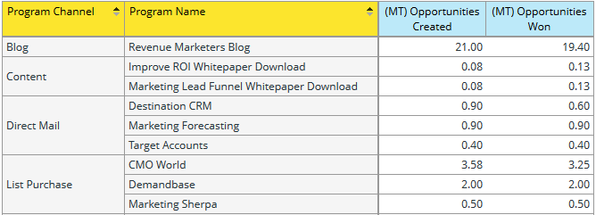
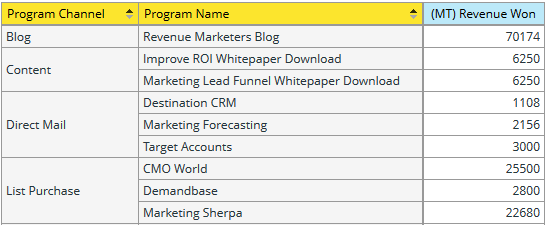
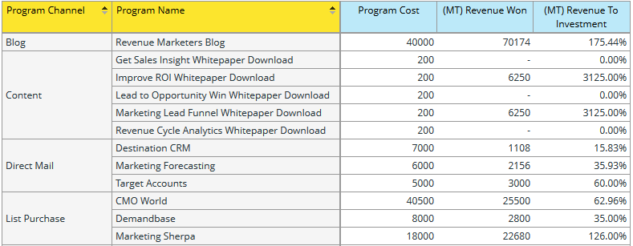
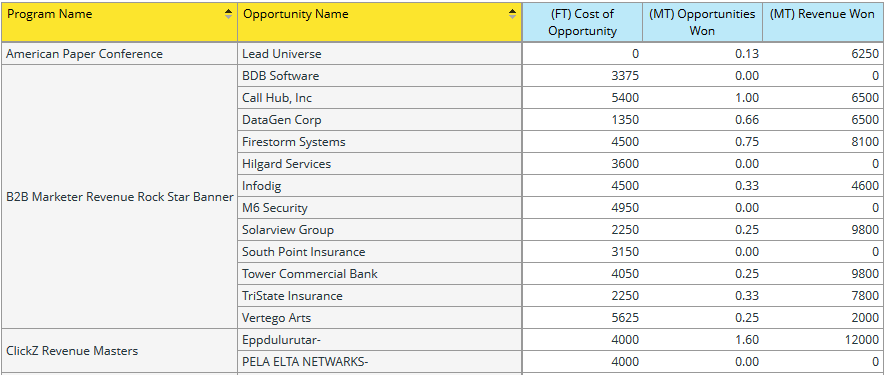

# Understanding the Program Opportunity Analysis Area {#understanding-the-program-opportunity-analysis-area}

## Overview {#overview}

The Program Opportunity Analysis area allows you to analyze the effectiveness of individual Programs or to see summarized results by Program Channel.

**Example business questions you can answer using this analysis area include**:

How many Opportunities were associated to a given Program and how many of those have we won?

How much revenue has a given Program or Channel helped generate?

What is my Revenue to Investment for a given Program or Channel?

Which Opportunities did a given Program influence?

## Program Opportunity Analysis Attribution Measures (Blue Dots) {#program-opportunity-analysis-attribution-measures-blue-dots}

Measures available for you to use in analysis are generally numbers and are represented by blue dots. Dimensions are attributes that give different views of the measures and are represented by yellow dots.

All measures (blue dots) relate to attribution - the “credit” for lead acquisition or for the sales success associated with a lead.

 

There are three kinds of measures:

* Acquisition-related measures, which get first-touch attribution (FT).
* Success-related measures, which receive multi-touch attribution (MT).
* Miscellaneous Program-related measures, including the average number of marketing touches before Opportunities are created or closed.

## Acquisition and Success-Related Measures {#acquisition-and-success-related-measures}

Acquisition-related measures give credit to the program through which a lead’s contact information are first obtained. A lead does not have to achieve success in a program for acquisition credit to be awarded.

The value of acquiring a given lead changes over time. It’s zero until a purchase is made by the lead. It can then increase with additional purchases.

Success-related measures give credit to all the programs that contribute to a lead’s progress towards a purchase.

As with acquisition, the value of contributing toward the sales made to a lead changes over time, and is zero until some purchase is made by the lead.

<table> 
 <tbody> 
  <tr> 
   <th>Attribution Measure - Opportunity-Related (FT or MT)*</th> 
   <th>Description</th> 
  </tr> 
  <tr> 
   <td>Cost of Opportunity</td> 
   <td>The portion of the cost of the program that influenced the opportunity. The cost may be split if there were multiple leads involved.</td> 
  </tr> 
  <tr> 
   <td>Opportunities Created</td> 
   <td>The portion of credit the program received for influencing the creation of the opportunity. It may be a fraction if there were multiple leads involved.</td> 
  </tr> 
  <tr> 
   <td>Opportunities Won</td> 
   <td>The portion of credit the program received for influencing the won opportunity. It may be a fraction if there were multiple leads involved.</td> 
  </tr> 
  <tr> 
   <td>Pipeline Created</td> 
   <td>The portion of credit (in monetary value) the program received for influencing the creation of the opportunity. It may be a fraction if there were multiple leads involved.</td> 
  </tr> 
  <tr> 
   <td>Pipeline Created - Still Open</td> 
   <td>The portion of credit (in monetary value) the program received for influencing creation of the currently open opportunity. It may be a fraction if there were multiple leads involved.</td> 
  </tr> 
  <tr> 
   <td>Revenue Expected</td> 
   <td>The portion of credit (in monetary value) the program received for influencing the creation of the opportunity. Expected Revenue is the opportunity probability multiplied by the opportunity value. It may be a fraction if there were multiple leads involved.</td> 
  </tr> 
  <tr> 
   <td>Revenue To Investment</td> 
   <td>This is the ratio of the portion of credit (in monetary value) the program received for influencing won opportunities and the cost of the program.</td> 
  </tr> 
  <tr> 
   <td>Revenue Won</td> 
   <td>The portion of credit (in monetary value) the program received for influencing won opportunity. It may be a fraction if there were multiple leads involved.</td> 
  </tr> 
 </tbody> 
</table>

_&#42; (FT) = First-Touch Attribution, used for measures of lead acquisition; (MT) = Multi-Touch Attribution, used for measures of lead success_

Below is a scenario that describes how Opportunity Units are calculated when there are two Programs that generated leads, but those leads led to one Opportunity from the same account.

**Program 1**

* Generates one lead: Lead 1
* Lead 1 is from Account 1

**Program 2**

* Generates another lead: Lead 2
* Lead 2 is also from Account 1

**Account 1**

* Generates one Opportunity: Opportunity 1

Marketo gives credit appropriately without double-counting Opportunities across Programs. So, in this instance, each Program receives 0.5 Opportunity Units. That is, each Program receives half of the credit for the generated Opportunity. Also, half the revenue associated with the Opportunity is assigned to each Program.

## Miscellaneous Program-Related Measures {#miscellaneous-program-related-measures}

The other measures available reflect the overall performance of the Program.

<table> 
 <tbody> 
  <tr> 
   <th>Attribution Measure - Program-Related</th> 
   <th>Description</th> 
  </tr> 
  <tr> 
   <td># of Opportunities Associated with Program</td> 
   <td>
The number of total Opportunities that had given any sort of attribution credit to a program. Opportunities can be influenced by one or more leads and by one or more Programs.
</td> 
  </tr> 
  <tr> 
   <td>Avg # of Successes per Closed Opportunity</td> 
   <td>The average number of Program successes before the Opportunity was closed.  </td> 
  </tr> 
  <tr> 
   <td>Avg # of Successes per Opportunity Created</td> 
   <td>The average number of Programs successes before the Opportunity was created.</td> 
  </tr> 
  <tr> 
   <td>New Names</td> 
   <td>The total number of new names, that is, new leads, acquired by the Program.</td> 
  </tr> 
  <tr> 
   <td>Program Cost</td> 
   <td>Total cost of the Program.</td> 
  </tr> 
  <tr> 
   <td>Success (Total)</td> 
   <td>The total number of Program members who achieved success.</td> 
  </tr> 
 </tbody> 
</table>

## Program Opportunity Analysis Dimensions (Yellow Dots) {#program-opportunity-analysis-dimensions-yellow-dots}

Whereas measures (blue dots) are calculated, and require some thought and explanation to use, dimensions (yellow dots) are descriptive. Here are the available dimensions.

<table> 
 <tbody> 
  <tr> 
   <th>Category</th> 
   <th>Display Label</th> 
  </tr> 
  <tr> 
   <td>Opportunity Attributes</td> 
   <td>Opportunity Closed Opportunity Name* Opportunity Owner Name Opportunity Stage Opportunity Type</td> 
  </tr> 
  <tr> 
   <td>Opportunity Timeframe</td> 
   <td>Opportunity Closed Year/Quarter/Month Opportunity Created Year/Quarter/Month</td> 
  </tr> 
  <tr> 
   <td>Program Attributes</td> 
   <td>Program Channel Program Name</td> 
  </tr> 
  <tr> 
   <td>Program Cost Timeframe</td> 
   <td>Cost Year/Quarter/Month</td> 
  </tr> 
 </tbody> 
</table>

*&#42;All of the Opportunities that gave any type of attribution credit to a Program. Opportunities can be influenced by one or more leads and by one or more Programs.*

>[!MORELIKETHIS]
>
>[Create a Revenue Explorer Report](/help/marketo/product-docs/reporting/revenue-cycle-analytics/revenue-explorer/create-a-revenue-explorer-report.md)
