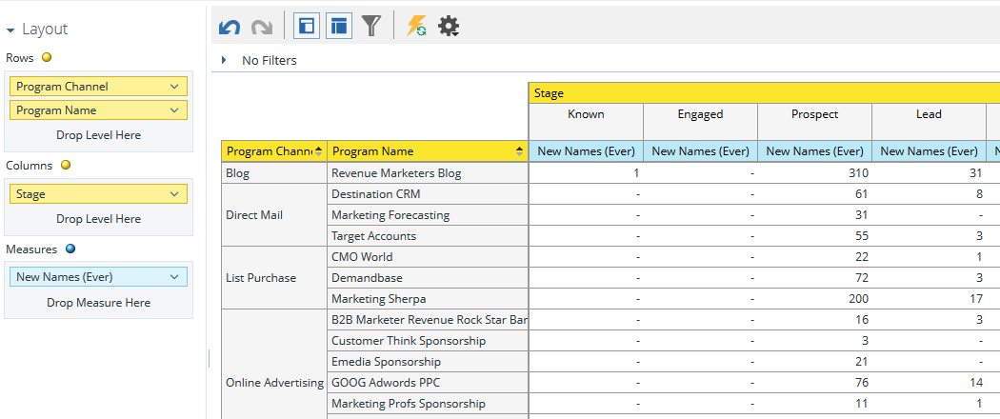
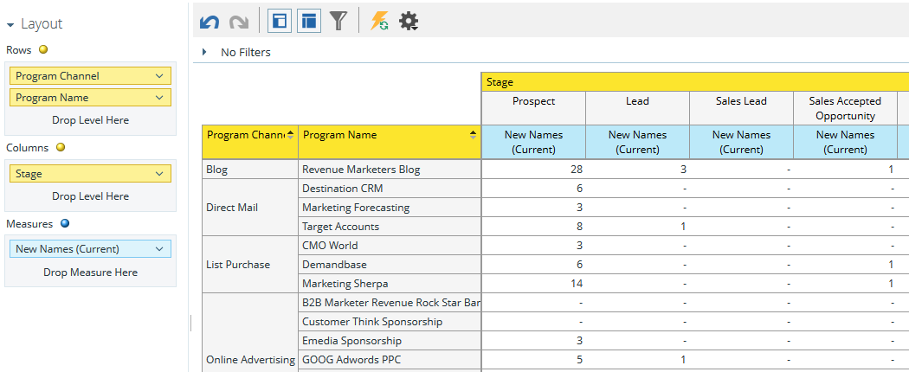

# Understanding the Program Revenue Stage Analysis Area {#understanding-the-program-revenue-stage-analysis-area}

This analysis area allows you to analyze the effectiveness of individual programs or to see summarized results by channel. It provides insights into how many of the new names generated have reached particular success path stages within your revenue cycle model.  
  
**Example business questions you can answer using this analysis area include**:

How many new names from a given program have ever reached a specific stage in my model?

How many new names from a given program are currently in a specific stage in my model?

How many days is it taking leads to reach their current stage?

**Program Revenue Stage Analysis Dimensions and Measures**

Dimensions and measures are categorized by functionality and are represented by yellow or blue dots in the system: yellow for dimensions and blue for measures. Use program revenue stage analysis dimensions and measures to answer specific questions in your report.

To view available dimensions or measures within a category, click the right arrow next to a category name to expand the category list. Click the down arrow to collapse the category list.

>[!TIP]
>
>To get more information about a particular dimension or measure while in the report, hover over it.

**Model Attributes** 

<table> 
 <tbody> 
  <tr> 
   <td colspan="1" rowspan="1"><strong>Dimension</strong></td> 
   <td colspan="1" rowspan="1">
<strong>Description</strong>
</td> 
  </tr> 
  <tr> 
   <td colspan="1" rowspan="1">
Is Model Active
</td> 
   <td colspan="1" rowspan="1">
Describes if the model is currently approved and active
</td> 
  </tr> 
  <tr> 
   <td colspan="1" rowspan="1">
Is Stage Active
</td> 
   <td colspan="1" rowspan="1">
Describes if the stage is active
</td> 
  </tr> 
  <tr> 
   <td colspan="1" rowspan="1">
On Success Path
</td> 
   <td colspan="1" rowspan="1">
Describes if the stage is on the success path or not
</td> 
  </tr> 
  <tr> 
   <td colspan="1" rowspan="1">
Model
</td> 
   <td colspan="1" rowspan="1">
Model Name
</td> 
  </tr> 
  <tr> 
   <td colspan="1" rowspan="1">
Stage
</td> 
   <td colspan="1" rowspan="1">
The stages that exists in your revenue cycle model. Used as the From stage when analyzing measures between two stages
</td> 
  </tr> 
  <tr> 
   <td colspan="1" rowspan="1">
Stage Type
</td> 
   <td colspan="1" rowspan="1">
Describes what type; Inventory, SLA or Gate each stage is
</td> 
  </tr> 
 </tbody> 
</table>

**Program Attributes**

<table> 
 <tbody> 
  <tr> 
   <td colspan="1" rowspan="1">
<strong>Dimension</strong>
</td> 
   <td colspan="1" rowspan="1">
<strong>Description</strong>
</td> 
  </tr> 
  <tr> 
   <td colspan="1" rowspan="1">
Program Channel
</td> 
   <td colspan="1" rowspan="1">
Program Channel
</td> 
  </tr> 
  <tr> 
   <td colspan="1" rowspan="1">
Program Name
</td> 
   <td colspan="1" rowspan="1">
Program Name
</td> 
  </tr> 
 </tbody> 
</table>

**Program Cost Timeframe**

<table> 
 <tbody> 
  <tr> 
   <td colspan="1" rowspan="1">
<strong>Dimension</strong>
</td> 
   <td colspan="1" rowspan="1">
<strong>Description</strong>
</td> 
  </tr> 
  <tr> 
   <td colspan="1" rowspan="1">
Cost Year
</td> 
   <td colspan="1" rowspan="1">
Program cost timeframe
</td> 
  </tr> 
  <tr> 
   <td colspan="1" rowspan="1">
Cost Quarter
</td> 
   <td colspan="1" rowspan="1">
Program cost timeframe
</td> 
  </tr> 
  <tr> 
   <td colspan="1" rowspan="1">
Cost Month
</td> 
   <td colspan="1" rowspan="1">
Program cost timeframe
</td> 
  </tr> 
 </tbody> 
</table>

**Stage Membership**

<table> 
 <tbody> 
  <tr> 
   <td colspan="1" rowspan="1">
<strong>Measure</strong>
</td> 
   <td colspan="1" rowspan="1">
<strong>Description</strong>
</td> 
  </tr> 
  <tr> 
   <td colspan="1" rowspan="1">
Is Model Active
</td> 
   <td colspan="1" rowspan="1">
Describes if the model is currently approved and active
</td> 
  </tr> 
  <tr> 
   <td colspan="1" rowspan="1">
Is Stage Active
</td> 
   <td colspan="1" rowspan="1">
Describes if the stage is active
</td> 
  </tr> 
  <tr> 
   <td colspan="1" rowspan="1">
On Success Path
</td> 
   <td colspan="1" rowspan="1">
Describes if the stage is on the success path or not
</td> 
  </tr> 
  <tr> 
   <td colspan="1" rowspan="1">
Cost per New Name
</td> 
   <td colspan="1" rowspan="1">
The average cost of a new name that ever reached the stage
</td> 
  </tr> 
  <tr> 
   <td colspan="1" rowspan="1">
New Names (Current)
</td> 
   <td colspan="1" rowspan="1">
Total number of leads who are currently in the stage and were acquired by the program
</td> 
  </tr> 
  <tr> 
   <td colspan="1" rowspan="1">
New Names (Ever)
</td> 
   <td colspan="1" rowspan="1">
Describes what type; Inventory, SLA or Gate each stage is
</td> 
  </tr> 
 </tbody> 
</table>

>[!MORELIKETHIS]
>
>[Create a Revenue Explorer Report](/help/marketo/product-docs/reporting/revenue-cycle-analytics/revenue-explorer/create-a-revenue-explorer-report.md)
