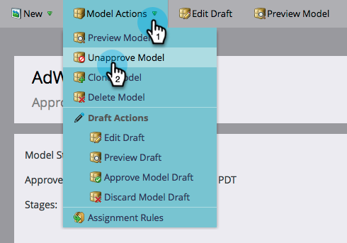

# Approve/Unapprove a Revenue Model {#approve-unapprove-a-revenue-model}

You may only have one approved model at any given time.

>[!NOTE]
>
>**FYI**
>
>Marketo is now standardizing language across all subscriptions, so you may see lead/leads in your subscription and person/people in docs.marketo.com. These terms mean the same thing; it does not affect article instructions. There are some other changes, too. [Learn more](http://docs.marketo.com/display/DOCS/Updates+to+Marketo+Terminology).

### What's in this article? {#whats-in-this-article}

[Approve](#approve)  
[Unapprove](#unapprove)

>[!CAUTION]
>
>[Individual stages must be approved](approving-stages-and-assigning-leads-to-a-revenue-model.md) and people added before you&nbsp;approve an entire model.

#### Approve {#approve}

1. Go to the **Analytics** area.

   

1. Select a model from the tree.

   

1. From the **Model Actions** menu, choose **Approve Model**.

   

1. A dialog appears to confirm your choice. Click **Approve**.

   

Your model is now live!&nbsp;

#### Unapprove {#unapprove}

>[!CAUTION]
>
>If you unapprove your model all of your people are removed from the model, and their history in the model is deleted!

1. Go to the **Analytics** area.

   

1. Select a model from the tree.

   

1. Click the **Model Actions** menu and choose **Unapprove Model**.

   

1. In the dialog that appears, click **Unapprove Model**.

   

Congrats! Your model is now unapproved.

>[!CAUTION]
>
>Unapproving a model removes all your people from the model, and removes their history in the model from the database.

