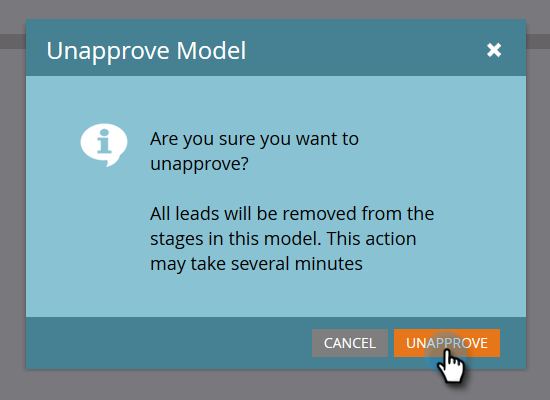

# Editing Your Approved Model {#editing-your-approved-model}

## Editing Your Model {#editing-your-model}

1. Select the model you want to make changes to in the Analytics section and click **Edit Draft**.

   

1. You can't delete stages when editing a draft model (after the model's been approved). Instead, you can merge that stage with another in the model. Right-click the stage you want to merge and click **Merge**.

   

1. Choose the new stage for leads currently in the one selected, or select **None **to remove the leads from your model. When you're done, click **Merge**.

   

1. When you're done making changes to the model, re-approve it by selecting **Approve Model Draft** in the **Model Actions** menu.

   

   >[!TIP]
   >
   >If you make any changes to your stages, such as adding or merging them, make sure to change your Assignment Rules and Phases to reflect your edits.

## Unapproving Your Model {#unapproving-your-model}

>[!CAUTION]
>
>If you unapprove your model, all of its leads will be removed, and their history in the model will be deleted. Consider editing your model instead of unapproving it.

1. Select the model you wish to unapprove. From the **Model Actions** menu, select **Unapprove Model**.

   

1. Click **Unapprove**.

   

>[!NOTE]
>
>If you want to re-approve this model, you'll first need to reassign leads to the stages.

## Creating More Models {#creating-more-models}

You can only have one approved model at a time. If you want to approve a model but already have one approved, you'll need to unapprove your current model first. If possible, try editing your model instead of creating a new one.

>[!MORELIKETHIS]
>
>[Create a New Revenue Model](../../../../../product-docs/reporting/revenue-cycle-analytics/revenue-cycle-models/create-a-new-revenue-model.md)

