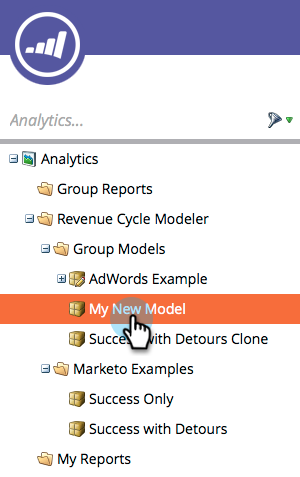
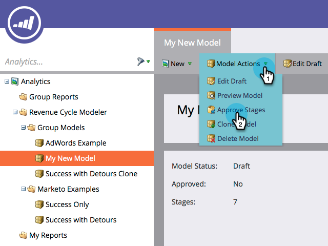
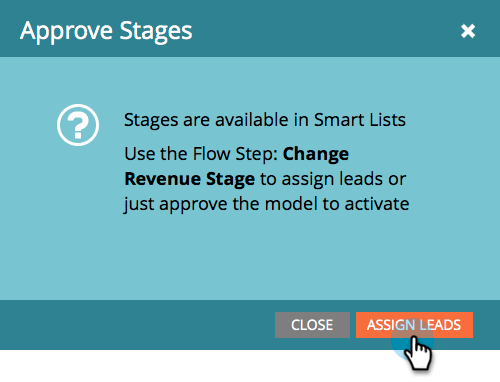
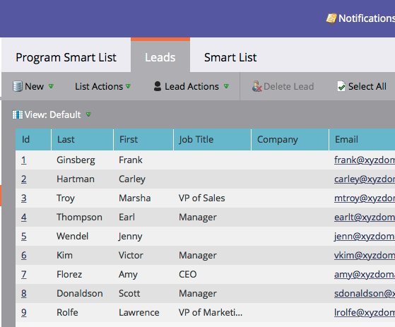
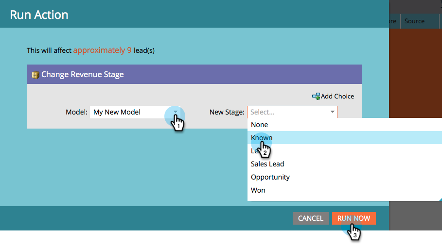
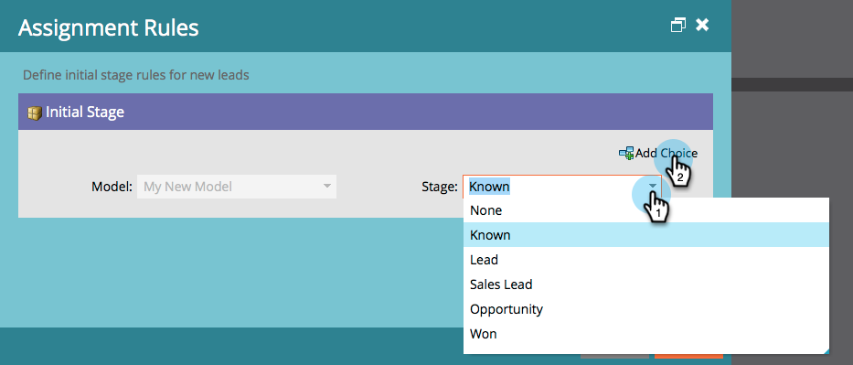
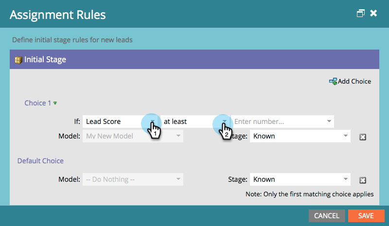

# Approving Stages and Assigning Leads to a Revenue Model {#approving-stages-and-assigning-leads-to-a-revenue-model}

Get your **Revenue Model** up and running by adding existing leads, creating assignment rules for any new leads.  

## Approving Stages {#approving-stages}

Let's approve the stages of your model before you add any leads.

1. Go to the **Analytics** area.

   

1. Select the model whose stages you'd like to approve.

   

1. Under **Model Actions**, select **Approve Stages**.

   

1. You'll be greeted with an alert; click **Assign Leads**.

   

Excellent! Let's move on and assign those leads.

## Assigning Existing Leads {#assigning-existing-leads}

[Create a Smart List](/help/marketo/product-docs/core-marketo-concepts/smart-lists-and-static-lists/creating-a-smart-list/create-a-smart-list.md) to identify the leads for one stage of your model in your Lead Database.

1. Once you've [created your Smart List](/help/marketo/product-docs/core-marketo-concepts/smart-lists-and-static-lists/creating-a-smart-list/create-a-smart-list.md), click the **Leads** tab.

   

1. Click **Select All** to select the leads.

   

1. Open the **Lead Actions** drop-down and select **Special**. Click **Change Revenue Stage**.

   

1. Select the correct **Model** and the correct **Stage**. Click **Run Now**.

   

1. Repeat until all your leads are assigned to the various stages of your model.

Great! To specify how new leads are assigned to stages, create assignment rules.

>[!NOTE]
>
>If your model is in the Approved Stages state, you will not see any Change Revenue Stage events in the leads' activity logs. If your model is fully approved, this flow step will be skipped if you move a lead into the same stage it's currently in.

## New Leads: Create Assignment Rules  {#new-leads-create-assignment-rules}

1. Click **Marketo Home** again, then select **Analytics**.

   

1. Click your model in the tree, then the **Model Actions** menu, selecting **Assignment Rules**.

   

1. If your assignment rules contain more than just one default choice click **Stage**, make your selection, then click **Add Choice**.

   

## Example Assignment Rule {#example-assignment-rule}

Create a Lead Score rule to assign the new leads with a minimum score to an appropriate step.

1. Under **If**, select **Lead Score**. Then choose **at least**.

   

1. Enter **40** in the field and select **Sales Lead** as a Stage. Click **Save** to complete.

   

>[!MORELIKETHIS]
>
>To approve your model, read our help page on **[Approving and Unapproving a Revenue Model](/help/marketo/product-docs/reporting/revenue-cycle-analytics/revenue-cycle-models/approve-unapprove-a-revenue-model.md)**.
