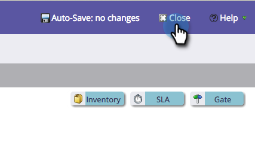

# Changing the Name of a Stage {#changing-the-name-of-a-stage}

Change your mind? Not a problem. Renaming a stage in the revenue cycle modeler is easy.

1. Go to the **Analytics** area.

   

1. Select a revenue cycle modeler to update. Click **Edit Draft**.

   

1. Select the stage you want to update and enter a new **Name**.

   

1. Click **Close**.

   

   See? Easy! Remember to [Approve your Model](/help/marketo/product-docs/reporting/revenue-cycle-analytics/revenue-cycle-models/approve-unapprove-a-revenue-model.md).
