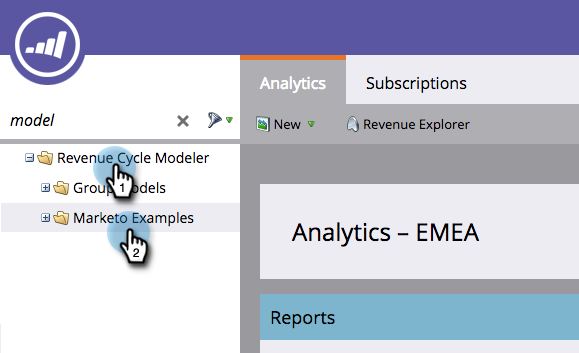
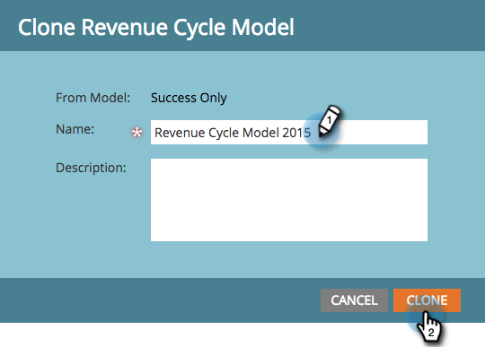

# Cloning a Marketo Example Revenue Model {#cloning-a-marketo-example-revenue-model}

Marketo has example revenue modelers to help inspire you. Clone these modelers and make them your own. Here is how:

1. Go to the **Analytics** area.

   

1. Select **Revenue Cycle Modeler** folder, and click **Marketo Examples**.

   

1. Choose one of the modelers.

   

1. From Model Actions, select **Clone Model**.

   

1. Enter a **Name** and click **Clone**.

   

   If only generating revenue was this easy!
