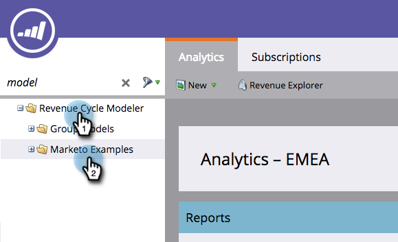
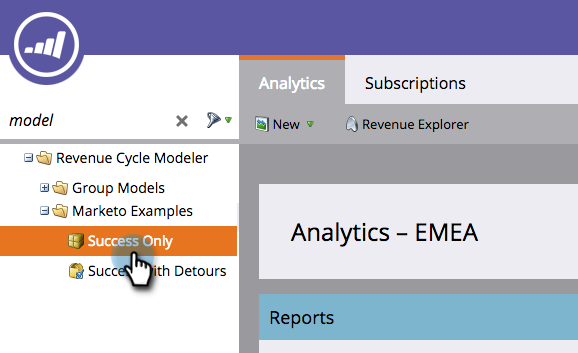

# Cloning a Marketo Example Revenue Model {#cloning-a-marketo-example-revenue-model}

Marketo has example revenue modelers to help inspire you. Clone these modelers and make them your own. Here is how:

1. Go to the **[!UICONTROL Analytics]** area.

   

1. Select **[!UICONTROL Revenue Cycle Modeler]** folder, and click **[!UICONTROL Marketo Examples]**.

   

1. Choose one of the modelers.

   

1. From [!UICONTROL Model Actions], select **[!UICONTROL Clone Model]**.

   

1. Enter a **[!UICONTROL Name]** and click **[!UICONTROL Clone]**.

   

   If only generating revenue was this easy!
