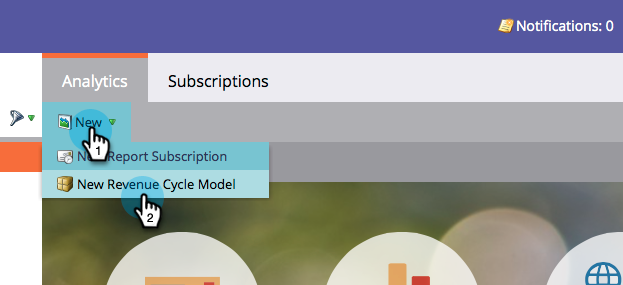
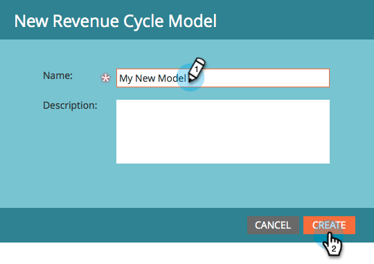
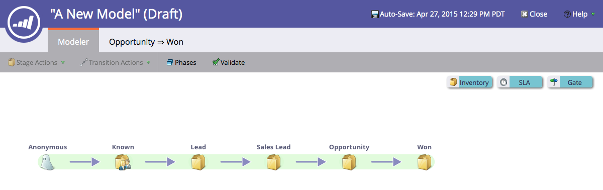

# Create a New Revenue Model {#create-a-new-revenue-model}

1. To create a new Revenue Cycle Model click the **Analytics** button in the My Marketo home screen.

   

1. In the **Analytics** tab, click **New** and select **New Revenue Cycle Model**.

   

1. A **New Revenue Cycle Model** modal window appears. Enter a name and click **Create**.

   

1. Click **Edit Draft** in the home view of your model.

   

1. In the new window, you'll be presented a model with six inventory stages, 5 transitions between these stages and the ability to add inventory, SLA and gate stages.

   

Looking sharp! You've just entered the wonderful world of modeling.

>[!MORELIKETHIS]
>
>Learn more about [Using Revenue Model Inventory Stages](/help/marketo/product-docs/reporting/revenue-cycle-analytics/revenue-cycle-models/using-revenue-model-inventory-stages.md).
