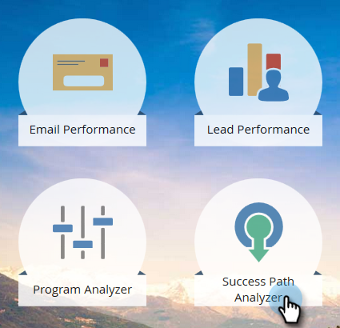
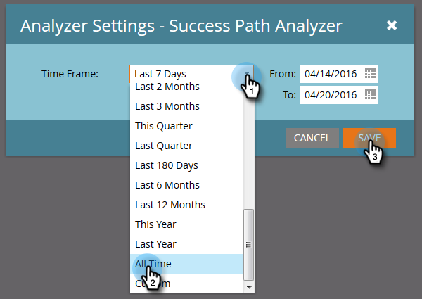
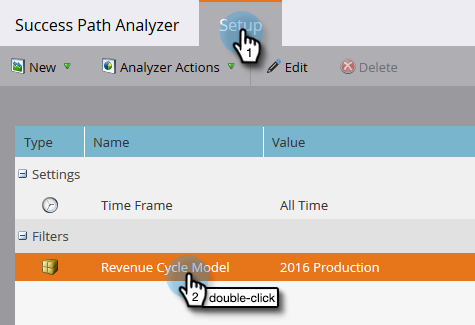
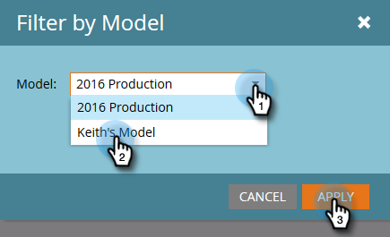
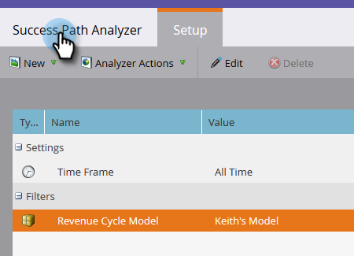

# Create a Success Path Analyzer {#create-a-success-path-analyzer}

Get a visual representation of velocity and flow through your Revenue Cycle Model.

>[!PREREQUISITES]
>
>[Create a New Revenue Model](/help/marketo/product-docs/reporting/revenue-cycle-analytics/revenue-cycle-models/create-a-new-revenue-model.md)

1. Click the **[!UICONTROL Analytics]** tile.

   

1. Click the **[!UICONTROL Success Path Analyzer]** icon.

   

   >[!NOTE]
   >
   >If you receive a warning that no data was found in the specified time frame, just click **[!UICONTROL Close]** to change your time frame. If you aren't prompted, but you want to change your time frame, go to **[!UICONTROL Setup]** and double-click **[!UICONTROL Time Frame]**.

1. If you had no data, or you're changing your time frame, select one from the drop-down and click **[!UICONTROL Save]**.

   

   >[!TIP]
   >
   >To select a specific range, select **[!UICONTROL Custom]** and use the **[!UICONTROL From]** and **[!UICONTROL To]** fields.

1. If you have more than one Revenue Cycle Model, select the one you want from the **[!UICONTROL Setup]** tab.

   

1. Pick the appropriate model and click **[!UICONTROL Apply]**.

   

1. Click the **[!UICONTROL Success Path Analyzer]** tab.

   

Now you can explore movement from each stage to the next!

>[!TIP]
>
>Wanna save your report? Click the **[!UICONTROL Analyzer Actions]** drop-down and select **[!UICONTROL Save As]**.

>[!MORELIKETHIS]
>
>[Using the Success Path Analyzer](/help/marketo/product-docs/reporting/revenue-cycle-analytics/revenue-cycle-models/using-the-success-path-analyzer.md)
