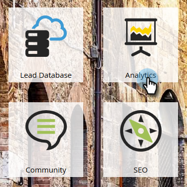

# Create a Success Path Analyzer {#create-a-success-path-analyzer}

Get a visual representation of velocity and flow through your [Revenue Cycle Model](https://docs.marketo.com/display/docs/revenue+cycle+analytics).

>[!PREREQUISITES]
>
>[Create a New Revenue Model](create-a-new-revenue-model.md)

1. Click the Analytics tile.

   

1. Click the Success Path Analyzer icon.

   

   >[!NOTE]
   >
   >If you receive a warning that no data was found in the specified time frame, just click **Close** to change your time frame. If you aren't prompted, but you want to change your time frame, go to **Setup** and double-click** ****Time Frame**.

1. If you had no data, or you're changing your time frame, select one from the drop-down and click Save.

   

   >[!TIP]
   >
   >To select a specific range, select **Custom** and use the **From** and **To** fields. 

1. If you have more than one Revenue Cycle Model, select the one you want from the Setup tab.

   

1. Pick the appropriate model and click Apply.

   

1. Click the Success Path Analyzer tab.

   

Now you can explore movement from each stage to the next!

>[!TIP]
>
>Wanna save your report? Click the **Analyzer Actions** drop-down and select **Save As**.

>[!MORELIKETHIS]
>
>* [Using the Success Path Analyzer](using-the-success-path-analyzer.md)
>

