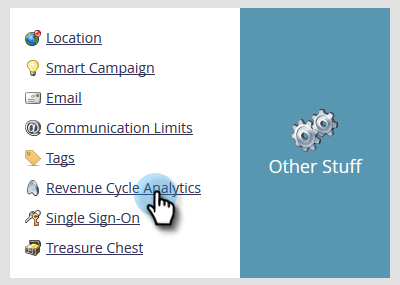
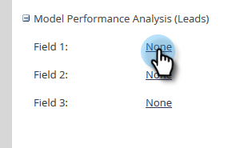
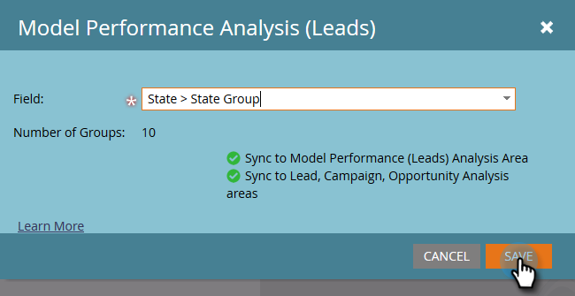

# Enable Custom Field Groups for Model Performance Analysis (Leads) {#enable-custom-field-groups-for-model-performance-analysis-leads}

>[!PREREQUISITES]
>
>Categorize standard or custom fields into groups for reporting via the Field Organizer in Marketo. For details, see [Create Custom Field Groups via the Field Organizer](/help/marketo/product-docs/reporting/revenue-cycle-analytics/revenue-tools/field-organizers/create-custom-field-groups-using-the-field-organizer.md).

<table> 
 <tbody> 
  <tr> 
   <td colspan="3" rowspan="1">
<strong>How Does Enabling a Custom Field Group Impact Multiple Analysis Areas in Revenue Cycle Explorer?</strong>
</td> 
  </tr> 
  <tr> 
   <td colspan="1" rowspan="1">
<strong>What happens when…?</strong>
</td> 
   <td colspan="1" rowspan="1">
<strong>How it impacts the Model Performance Analysis (Leads) Area</strong>
</td> 
   <td colspan="1" rowspan="1">
<strong>How it impacts the Lead Analysis, Campaign Analysis, and Opportunity Analysis Areas</strong>
</td> 
  </tr> 
  <tr> 
   <td colspan="1" rowspan="1">
<strong>What happens when you enable a custom field group associated with a standard lead or company field?</strong>
</td> 
   <td colspan="1" rowspan="1">
The custom field group is enabled for reporting in the Model Performance Analysis (Leads) Area
</td> 
   <td colspan="1" rowspan="1">
No Impact
</td> 
  </tr> 
  <tr> 
   <td colspan="1" rowspan="1">
<strong>What happens when you enable a custom field group associated with a custom person or company field?</strong>
</td> 
   <td colspan="1" rowspan="1">
The custom field group is enabled for reporting in the Model Performance Analysis (Leads) Area
</td> 
   <td colspan="1" rowspan="1">
The custom field itself is enabled for reporting in the Lead Analysis, Campaign Analysis, and Opportunity Analysis Areas.

<strong>NOTE:</strong> Custom field groups are NOT supported in these analysis areas, so the group associations do not display in Revenue Cycle Explorer--<em>only</em> the custom field.
</td> 
  </tr> 
 </tbody> 
</table>

Follow these steps to enable a custom field group for reporting in the Model Performance Analysis (Leads) area.

1. Click **Admin**.

   

1. Click **Revenue Cycle Analytics**.

   

1. Click **None** next to an empty field group. If you already have three field groups enabled and want to make an edit, click the name of the field group you wish to modify.

   

1. Click the **Field** drop-down and select the one you want.

   

   >[!NOTE]
   >
   >This example enabled a custom field group for a standard field (State). Therefore, only the Model Performance Analysis (Leads) Area was impacted. If a custom field group for a custom person or company field had been enabled, the enabled group would display in the Model Performance Analysis (Leads) section of the Sync Summary tab and the custom field count for Lead, Campaign, and Opportunity Analysis would increase by one.

1. Click **Save**.

   
