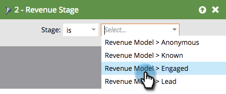
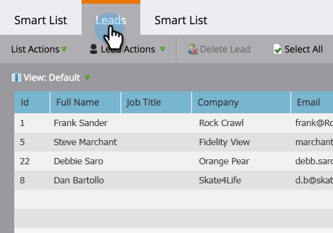

# Find all Leads in a Revenue Cycle Model {#find-all-leads-in-a-revenue-cycle-model}

By using smart lists, you can easily find all members of revenue cycle model.

>[!NOTE]
>
>**Prerequisites**
>
>[Create a Smart List](../../../../product-docs/core-marketo-concepts/smart-lists-and-static-lists/creating-a-smart-list/create-a-smart-list.md)

1. With the smart listed selected, click on the **Smart List** tab.

   

1. Find the **Member of Revenue Model** filter and drag it into the canvas.

   

1. Select a **Model**.

   

   This would get you all the leads in that model, regardless of stage. Usually you will want a specific stage. Use the following filter instead.

1. Find the **Revenue Stage **filter and drag it into the canvas.

   

1. Select a **Stage.**

   

1. Go to the **Leads** tab to view the results.

   

   >[!TIP]
   >
   >You don't need both filters, just choose the one you need. We are just showing you both to be thorough.    >
   >

   >[!CAUTION]
   >
   >If the stage of a lead is changed by an external campaign during the initial creation of the lead, then an activity is not logged in the database. This means that the lead won’t be included by the smart list filter.

