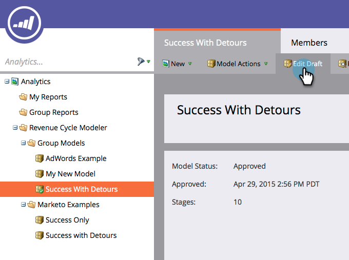
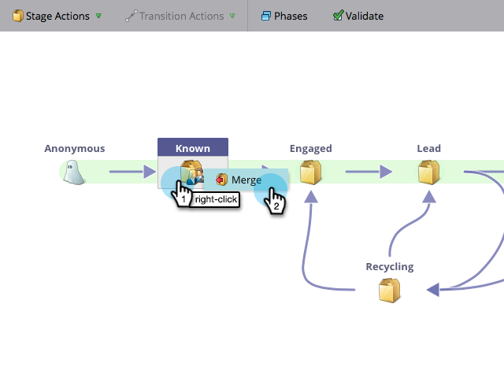
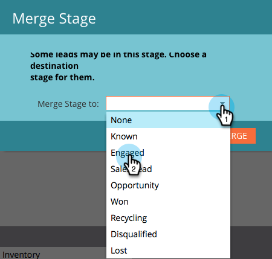
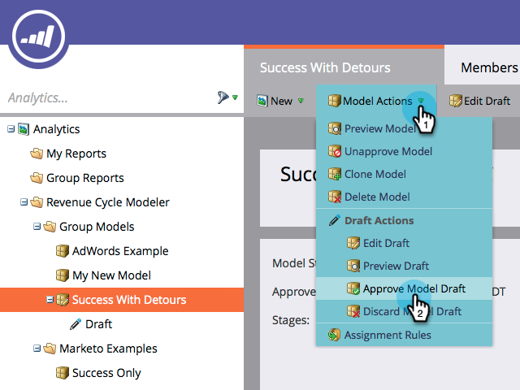

# Merging Two Stages in the Revenue Modeler {#merging-two-stages-in-the-revenue-modeler}

After you've approved the model, you cannot delete stages when editing a draft. Instead, you can merge that stage with another.

1. Click **Marketo Home** and select **[!UICONTROL Analytics]**.

   

1. Click your approved model.

   

1. Click **[!UICONTROL Edit Draft.]**

   

1. Right-click the stage you want to merge and select **[!UICONTROL Merge Stage]** in the menu.

   

1. Click the specific stage in the pull down.

   

1. You can re-approve the model by selecting **[!UICONTROL Approve Model Draft]** in the **[!UICONTROL Model Actions]** menu.

   

>[!NOTE]
>
>Pick **[!UICONTROL None]** in the [!UICONTROL Merge Stage] pull down to remove the leads from your model
