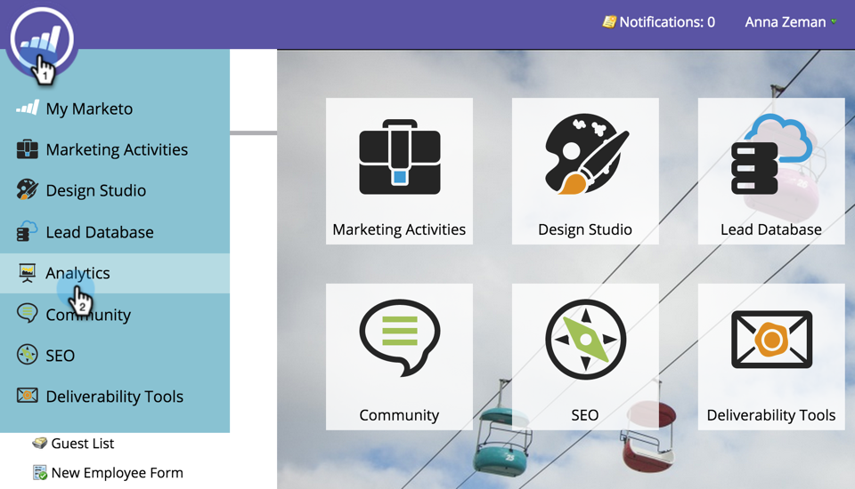
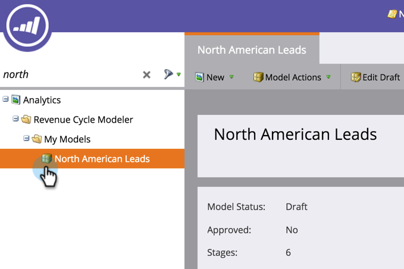
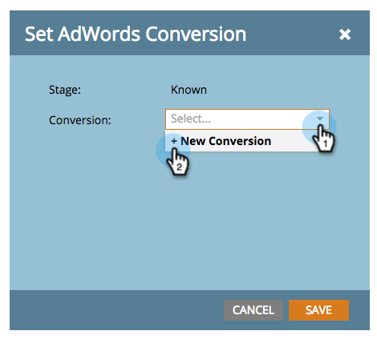
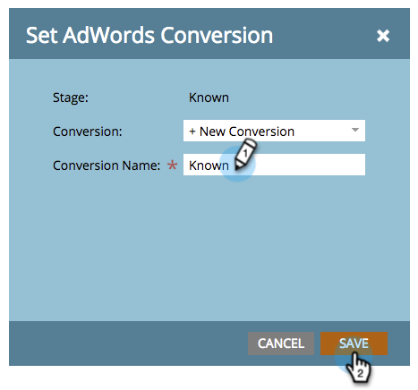
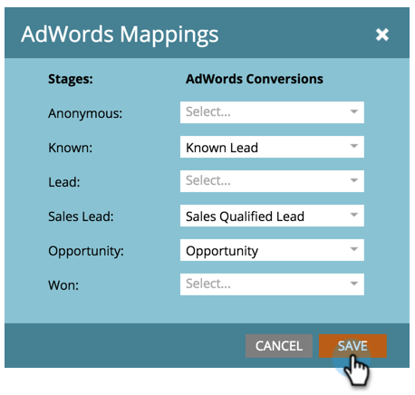

# Set [!DNL Google AdWords] Conversions in the Revenue Model {#set-google-adwords-conversions-in-the-revenue-model}

Link your [!DNL Google AdWords] account to Marketo to automatically upload offline conversion data from Marketo to [!DNL Google AdWords]. Then, from the [!DNL AdWords] UI, you will be able to easily see which clicks resulted in qualified leads, opportunities and new customers (or whatever revenue stages you want to track) after you [add custom columns](https://support.google.com/adwords/answer/3073556) in [!DNL AdWords].

>[!NOTE]
>
>This is a push integration from Marketo to [!DNL Google AdWords]. Conversion data will appear _only_ in your [!DNL Google AdWords] portal, _not in the Marketo UI_.

Learn more about [Google’s offline conversion import feature](https://support.google.com/adwords/answer/2998031?hl=en). Map [!DNL AdWords] offline conversions to one or more stages in a Revenue model. There are three ways to do the mapping:

* [!DNL AdWords] Conversion
* Stage Action
* [!DNL AdWords] Mapping

You can create a new [!DNL AdWords] offline conversion from Marketo if you use Stage Action.

>[!PREREQUISITES]
>
>[Add [!DNL Google AdWords] as a LaunchPoint Service](/help/marketo/product-docs/administration/additional-integrations/add-google-adwords-as-a-launchpoint-service.md)

## Use [!DNL AdWords] Conversion {#use-adwords-conversion}

1. Go to the **[!UICONTROL Analytics]** area.

   

1. Select a model.

   

1. Click **[!UICONTROL Edit Draft]**.

   

1. Select the revenue stage you want to map to an [!DNL AdWords] conversion.

   

1. Select the **[!UICONTROL AdWords Conversion]** you'd like to map to your Marketo stage.

   

   Nice! Your [!DNL AdWords] conversion data will be uploaded to your [!DNL Google AdWords] at the cadence you selected.

## Use Stage Action {#use-stage-action}

You can also map an [!UICONTROL AdWords Conversion] under Stage Actions.

1. Select the step you want to map to an [!DNL AdWords] conversion.

   

1. Under the **[!UICONTROL Stage Actions]** drop down, select **[!UICONTROL Set AdWords Conversion]**.

   

1. Select an **[!UICONTROL AdWords Conversion]**.

   

   **Tip**: If you don't have any [!DNL AdWords] conversions, create one by clicking **[!UICONTROL +New Conversion]**.

   

1. Click **[!UICONTROL Save]**.

   

1. After you are done mapping all of your [!DNL AdWords] conversions to revenue stages, go back to the summary page. Select **[!UICONTROL Model Actions]** and choose **[!UICONTROL Approve Stages]**.

   

## Pro tip: Add a New Conversion {#pro-tip-add-a-new-conversion}

Pro tip! A new [!DNL AdWords] offline conversion can be created from Marketo.

>[!CAUTION]
>
>New conversions created from Marketo have the "optimization" setting enabled. This means that [!DNL AdWords] bid strategies are allowed to optimize your bids for those conversions. You can change this setting from your [!DNL AdWords] account.

1. Under the **[!UICONTROL Stage Actions]** drop down, select **[!UICONTROL Set AdWords Conversion]**.

   

1. Select **[!UICONTROL New Conversion]**.

   

1. Enter a **[!UICONTROL Conversion Name]**. Click **[!UICONTROL Save]**.

   

   Excellent! This new conversion will appear in your [!DNL AdWords] account.

## Use [!DNL AdWords] Mapping {#use-adwords-mapping}

You can associate all your model stages with your [!UICONTROL AdWords Conversion] in one place using [!DNL AdWords] Mappings.

1. Select **[!UICONTROL Edit AdWords Mappings]**.

   

1. Select the desired **[!UICONTROL AdWords Conversion]** for each stage that you want to track.

   

1. Once you've mapped your stages, click **[!UICONTROL Save]**.

   

1. After you are done mapping all of your [!DNL AdWords] conversions to revenue stages, go back to the summary page. Select **[!UICONTROL Model Actions]** and choose **[!UICONTROL Approve Stages]**.

   

In order to view the offline conversion data, you will need to log into your [!DNL AdWords] account. We recommend you use their [Custom Columns feature](https://support.google.com/adwords/answer/3073556) to create conversion count columns for each offline conversion you import from Marketo.
