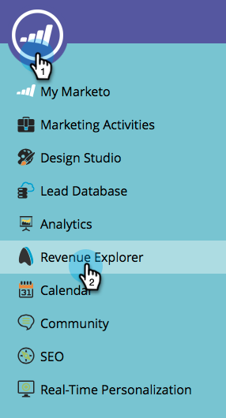
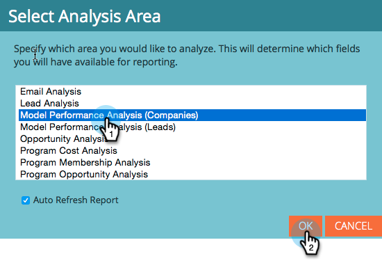
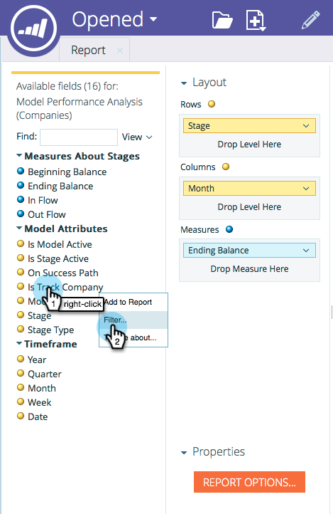

# Start Tracking by Account in the Revenue Modeler {#start-tracking-by-account-in-the-revenue-modeler}

With the Revenue Stage Modeler and [!UICONTROL Revenue Explorer], you gain insight into the performance of your leads and accounts as they progress through your model.

>[!NOTE]
>
>Make sure that your approved model has stages on the success path with **Start Tracking by Account** checked

1. After enough time has passed to collect useful data, select **[!UICONTROL Revenue Explorer]** under the **My Marketo Home**.

   

1. To create a new report, click **[!UICONTROL File]** and select **[!UICONTROL New]** then **[!UICONTROL Report]**.

   

1. Select **[!UICONTROL Model Performance Analysis (Companies)]** as the analysis area and click **[!UICONTROL OK]**.

   

1. We recommend you drag in the **[!UICONTROL Stage]**, **[!UICONTROL Month]**, and **[!UICONTROL Ending Balance]** fields to show you the progression of companies through your model by month. Use filters to select the months that you want.

   

1. When you're done setting up your report, right click on **[!UICONTROL Is Track Company]** and select **[!UICONTROL Filter]**. We'll use this to limit the report to only stages where **Tracking by Account** is selected.

   

1. In the dialog that appears, select **[!UICONTROL Yes]** and click the right-pointing arrow in the middle. This will filter only those stages with "Tracking by Account" enabled. Click **[!UICONTROL OK]** when you're done.

   

1. Your report should now show only those stages you're tracking by account. Make sure to save your report so you can use it in the future. Now you can use this as another measure of the success of your marketing efforts.
