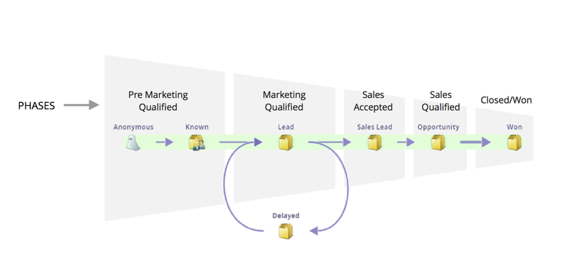

# Understanding Revenue Model Phases {#understanding-revenue-model-phases}

Phases are a way to group a number of stages. Sometimes multiple stages in a model reflect one phase of a funnel.

## Define the Phases of the Model {#define-the-phases-of-the-model}

1. Click **Phases**.

   

1. Click the blue button to drag the phases up and down through the stages.

   
