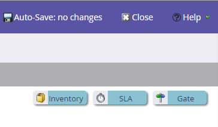
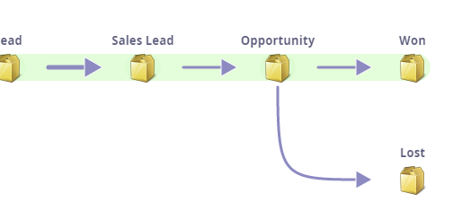

# Understanding Revenue Models {#understanding-revenue-models}

Revenue cycle models take marketing to the next level. They model all the stages of your entire revenue funnel—from when you first interact with a lead all the way until the lead is a won customer.

## Mental Model (How to think about this thing) {#mental-model-how-to-think-about-this-thing}

The Modeler is like a series of buckets with water in them. There are holes in the bottom of the buckets.

The modeler will measure how much water (leads) goes into the bucket per day and how much goes out of the holes. (There can be more than one hole)

The modeler all measures the amount of leads in the bucket at any given time. This is called the stage balance.

>[!TIP]
>
>For those who are more financially minded, you can think of the stages as accounts with money flowing in and out with balance at the end of each day.

Models are generally for customers who are comfortable with smart campaigns and programs and want to take their analytics to the next level.  

## Starting with a New Model {#starting-with-a-new-model}

By default, a new model starts you off with six revenue stages. This model is actually fine all by itself, but it can be deeply customized. 

Notice they are all on a green background. This is called the **Success Path**. Understand more about the success path [here](/help/marketo/product-docs/reporting/revenue-cycle-analytics/revenue-cycle-models/understanding-revenue-model-success-path.md).

**Stages** are the milestones on a leads progressions towards their goals.

**Transitions** are shown as arrows and they control how leads move between stages.

>[!NOTE]
>
>The Anonymous Stage is special. It is all of the people who visit your website, but you aren't sure who they are. You can not modify this stage.

## Customization {#customization}

Every company is different. You can add things to the model by dragging from the top right.

## Inventory Stage {#inventory-stage}

This looks like a box and is the most basic of stages. Analytics will keep track of inflow, outflow and balance of this stage.

## SLA Stage {#sla-stage}

This is short for **Service Level Agreement** stage. The intent here is that some stages you will want to enforce a time limit.

>[!NOTE]
>
>**Example**
>
>When a lead fills out a "Contact Me" form and you send an alert to a sales rep, you may want a 72 hour SLA. You will be able to keep track of infractions and scold the rep for leaving a good lead incommunicado.

## Gate Stage {#gate-stage}

A Gate stage is meant for situations where you want to filter leads into one of several choices. This is an advanced option. Beginners should avoid gates.

>[!NOTE]
>
>**Example**
>
>A gate could be used for leads who are part of a **named account list** to separate this from the normal process.

## Transitions {#transitions}

Clarify exactly how a lead moves from one stage to another using smart campaigns and make sure leads don't get stuck in any stage. Be sure to use trigger filters for transitions to (that's a way to evaluate).

>[!NOTE]
>
>**Example**
>
>A transition could be defined by a lead filling out a form.

Adding a Stage off the happy success path

Lost is a good one to add, but notice it is not on the green path. That is because it is not a "success".

>[!MORELIKETHIS]
>
>* [Create a New Revenue Model](/help/marketo/product-docs/reporting/revenue-cycle-analytics/revenue-cycle-models/create-a-new-revenue-model.md)
>
>* [Using Revenue Model Inventory Stages](/help/marketo/product-docs/reporting/revenue-cycle-analytics/revenue-cycle-models/using-revenue-model-inventory-stages.md)
>
>* [Using Revenue Model Gate Stages](/help/marketo/product-docs/reporting/revenue-cycle-analytics/revenue-cycle-models/using-revenue-model-gate-stages.md)
>
>* [Using Revenue Model SLA Stages](/help/marketo/product-docs/reporting/revenue-cycle-analytics/revenue-cycle-models/using-revenue-model-sla-stages.md)
>
>* [Report on Your Revenue Model](/help/marketo/product-docs/reporting/revenue-cycle-analytics/revenue-cycle-models/report-on-your-revenue-model.md)
>
>* [Approve/Unapprove a Revenue Model](/help/marketo/product-docs/reporting/revenue-cycle-analytics/revenue-cycle-models/approve-unapprove-a-revenue-model.md)
