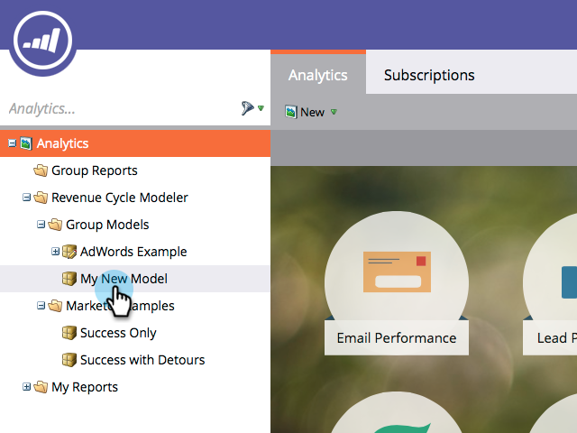
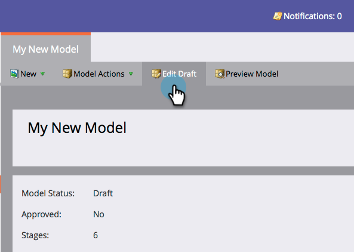
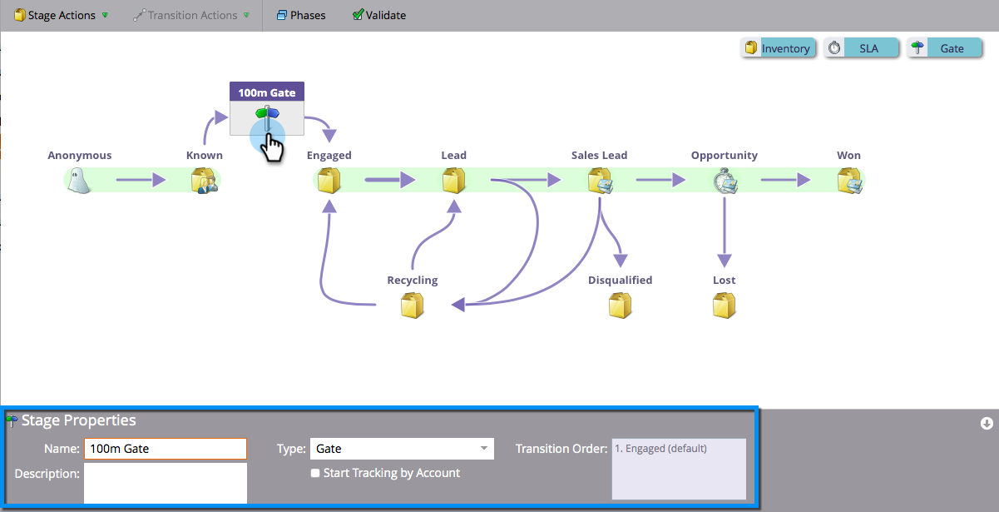
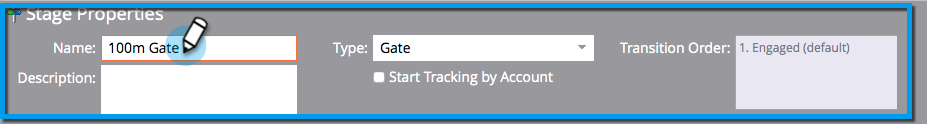
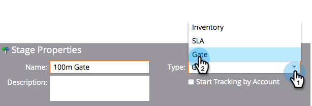
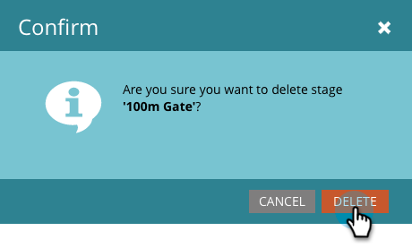

# Using Revenue Model Gate Stages {#using-revenue-model-gate-stages}

Using Revenue Model Gate Stages - Marketo Docs - Product Documentation

A gate stage serves as a qualification check.

>[!TIP]
>
>It's a great idea to create a practice model in a graphics or presentation program and confirm it with your colleagues.

#### Add A Gate Stage {#add-a-gate-stage}

1. Go to the **Analytics** area.

   

1. Select an existing model, or [create a new one](create-a-new-revenue-model.md).

   

1. Click **Edit** **Draft**.

   

1. Click the **Gate** button, then drag and drop anywhere in the canvas.

   

1. Edit the **Name **and select a **Type**.

   >[!NOTE]
   >
   >Select [Start Tracking by Account](start-tracking-by-account-in-the-revenue-modeler.md) at this time to gain insight into the performance of your accounts as they progress through your model.

   

>[!NOTE]
>
>The Gate Stage splits leads based on criteria you enter in the transition rules; **it does not hold leads**. A default transition is required so that leads that aren’t chosen by the other transitions end up going through the default.

#### Edit a Gate Stage {#edit-a-gate-stage}

##### Edit the Name, Description, and adjust the Type of your Gate stage. You can also opt to [Start Tracking by Account](start-tracking-by-account-in-the-revenue-modeler.md). {#edit-the-name-description-and-adjust-the-type-of-your-gate-stage-you-can-also-opt-to-start-tracking-by-account}

1. Click a **Gate** stage icon.

   

1. Click within the **Name** and **Description** fields to edit their content.

   

1. Select the **Type** drop-down to edit.

   

#### Delete A Gate Stage {#delete-a-gate-stage}

1. You may delete a Gate Stage by right-clicking the Gate stage icon and selecting **Delete**.

   

1. You may also delete a Gate stage by clicking it, then in the **Stage Actions** drop-down, selecting **Delete**.

   

1. Both methods of deletion ask you to confirm your choice. Click **Delete**.

   

Congrats! Now you understand the wonderful world of Gate Stages.

>[!NOTE]
>
>**Related Articles**
>
>* [Using Revenue Model Inventory Stages](using-revenue-model-inventory-stages.md)
>* [Using Revenue Model SLA Stages](using-revenue-model-sla-stages.md)
>* [Create a New Revenue Model](create-a-new-revenue-model.md).
>

