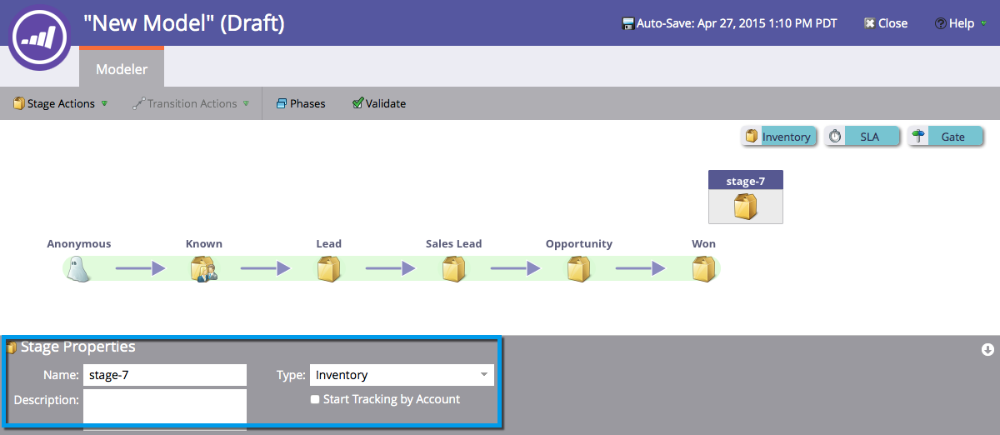
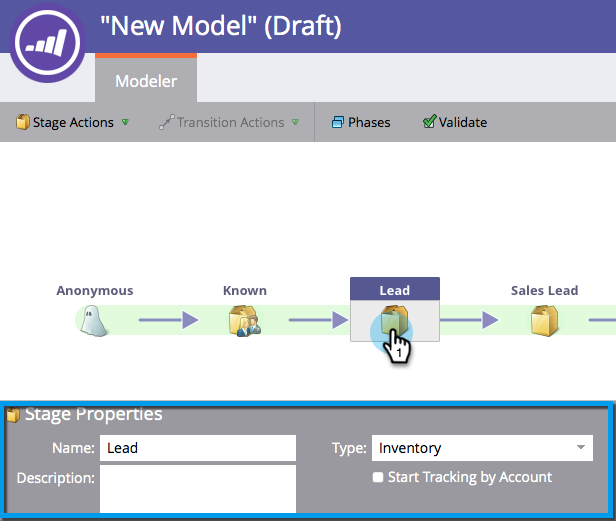
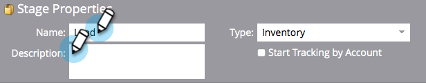
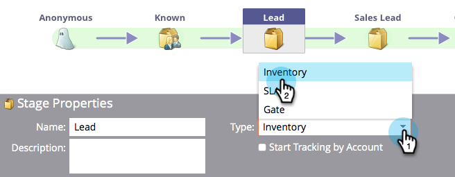
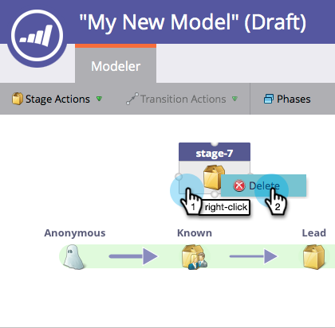
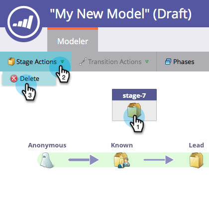
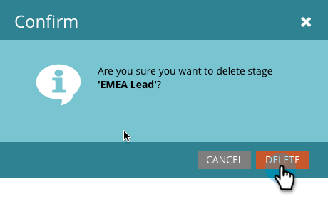

# Using Revenue Model Inventory Stages {#using-revenue-model-inventory-stages}

All known leads and accounts initially reside in the Inventory Stage. This prospect pool is where leads are nurtured until sales-ready. There is no time limit on an inventory stage.

>[!TIP]
>
>##### It's a great idea to create a practice model in a graphics or presentation program and confirm it with your colleagues first.&nbsp; {#its-a-great-idea-to-create-a-practice-model-in-a-graphics-or-presentation-program-and-confirm-it-with-your-colleagues-first}>

#### Add An Inventory Stage {#add-an-inventory-stage}

1. To add a new Revenue Cycle Model Inventory stage, click the **Analytics** button in the **My Marketo** home screen.

   

1. In the **Analytics** section, select your existing model, or [create a new one](create-a-new-revenue-model.md).

   

1. Click **Edit Draft**.

   

1. To add a new inventory stage, click the **Inventory** button, then drag and release to anywhere within the canvas.

   

1. You are free to edit the Name, add a Description and adjust the Type after adding a stage. You may also select ** [Start Tracking by Account](start-tracking-by-account-in-the-revenue-modeler.md)** at this time.

   

#### Edit an Inventory Stage {#edit-an-inventory-stage}

When you select an Inventory icon you may edit the **Name**, add a **Description** or adjust the **Type**. You may also select [Start Tracking by Account](start-tracking-by-account-in-the-revenue-modeler.md).

1. Click an Inventory icon.

   

1. Click within the **Name** and **Description** fields to edit their content.

   

1. Select the **Type** pulldown to edit.

   

#### Delete An Inventory Stage {#delete-an-inventory-stage}

1. You may delete an Inventory Stage by right clicking or control clicking an inventory stage icon.

   

1. You may also delete a stage by clicking it, then in the **Stage Actions** dropdown, select **Delete**.

   

1. Both methods of deletion ask you to confirm your choice. Click **Delete**.

   

Congrats! Now you understand the wonderful world of Inventory Stages.
